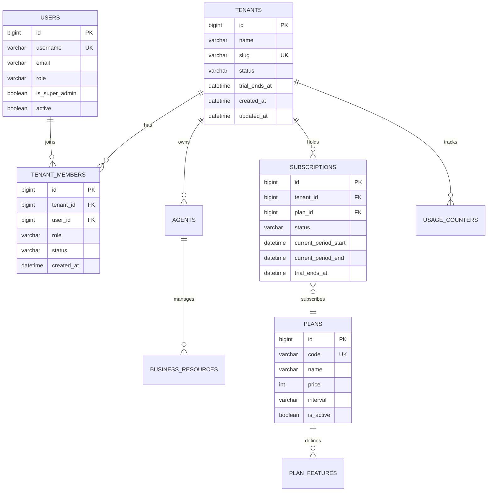

# RUANGKIRIM — PHASE 2B.0 SAAS ARCHITECTURE & DATABASE READ-ONLY AUDIT
**Project:** Ruangkirim
**Repository:** `mrifatsyauqi/ruangkirim`
**Audit Type:** Read-Only Architectural, Database, Authentication, & Multi-Tenant Audit
**Date:** September 11, 2026
**Status:** COMPLETED (AUDIT ONLY — ZERO CODE/DB MUTATION)

---

## 1. Executive Summary

A comprehensive, empirical, read-only audit of the Ruangkirim application, database architecture, authentication system, multi-tenant isolation boundaries, subscription/plan foundation, and migration mechanisms was conducted across the local repository, staging environment, and live production environment.

### Core Audit Conclusion
**Ruangkirim is currently an internal single-tenant company installation with partial logical multi-tenant scaffolding, NOT an active multi-tenant SaaS platform.**

1. **Database Baseline:** Both Production (`ruangkirim`) and Staging (`ruangkirim_staging`) contain exactly **45 tables**.
2. **Tenant Model:** Table `tenants` contains exactly **1 record** (`id=1, name='Default'`). Columns are limited to `id`, `name`, `created_at`, and `updated_at`. There are **no columns** for `slug`, `status`, `trial_ends_at`, plan association, billing identifiers, or customer metadata.
3. **SaaS Tables:** **0 SaaS subscription tables exist in the database.** There are no `plans`, `subscriptions`, `plan_features`, `tenant_members`, `usages`/`usage_counters`, or platform `audit_logs` tables.
4. **Plan & Quota Enforcement:** Feature gating functions `tenantPlanAllows(tenantID, feature)` and `agentPlanAllows(agentID, feature)` in `backend/handlers/plan_features.go` **unconditionally return `true`**. Quotas, limits, and plan tiers are completely unenforced.
5. **Trial Model & 1-Sender Limit:** **100% absent in code and schema.** The 30-day trial and maximum 1-sender trial limit exist only as design proposals in documentation. The agent creation handler explicitly states: `// Tidak ada batas jumlah nomor — internal company, tanpa paket langganan.`
6. **Registration & Onboarding:** **Public registration is completely disabled/non-existent.** In `backend/handlers/auth.go:476`: `// Register tidak tersedia — instalasi internal perusahaan, user dibuat oleh superadmin.` The frontend has no registration routes or forms.
7. **Multi-Tenant Isolation:** 17 tables have a direct `tenant_id` column. 22 business tables (including `chat_histories` with 29,941 rows, `contacts` with 532 rows, and `knowledges` with 13 rows) rely on **indirect tenant ownership** via `agent_id -> agents.tenant_id`. Handlers consistently enforce `resolveAgent()`, which validates `agent.tenant_id == currentTenantID(c)`. Direct data leakage between tenants via existing agent-scoped endpoints is prevented, but direct-table queries without agent scoping represent a architectural fragility.
8. **Database Migration Safety:** GORM `DB.AutoMigrate(...)` executes automatically on **every application startup** in both staging and production across 41 model structs. There is **no schema versioning mechanism** (no goose, golang-migrate, or migration tracking table). Uncontrolled DDL changes during Phase 2B pose a severe P0 stability risk if AutoMigrate is not strictly governed.

---

## 2. Audit Scope

The audit covered all runtime layers, databases, codebases, and configurations:

| Layer | Environment | Identifier / Target | State Verified |
|---|---|---|---|
| **Production Server** | Live VPS (43.173.7.8) | `/var/www/ruangkirim` (port 3031) | Commit `ed2a0fb`, PID 1739418, healthy HTTP 200 |
| **Staging Server** | Live VPS (43.173.7.8) | `/var/www/ruangkirim-staging` (port 3032) | Commit `ed2a0fb`, PID 1734640, healthy HTTP 200 |
| **Production Database** | MySQL 8.0 | `ruangkirim` | Exactly 45 tables, 29,941 chat rows, 1 tenant, 1 user, 1 agent |
| **Staging Database** | MySQL 8.0 | `ruangkirim_staging` | Exactly 45 tables, 1 tenant, 1 user, 1 agent |
| **WhatsApp Storage** | Production VPS | `/var/lib/ruangkirim/whatsapp/` | `wa-session-agent-3.db` (44.3 MB, active, untouched) |
| **Legacy ChatLoop** | Production VPS | `/var/www/chatloop` | Inactive, port 3030 closed, `chatloop.service` inactive |
| **Application Source** | Git Repository | Branch `develop` (commit `98571c3`) | Codebase, models, handlers, routes, services, migrations |
| **Documentation** | Local Repo Docs | `docs/*.md` | Historical specs vs live implementation reconciliation |

---

## 3. Evidence & Methodology

The audit adhered strictly to the **Source of Truth Priority**:
`Live Production Evidence > Source Code > Database Schema > Routes/API > Tests > Documentation`.

### Verified Live Baselines:
- **Production Git Commit:** `ed2a0fb`
- **Production Service Status:** `active (running) since Fri 2026-09-11 14:45:23 CST` (PID 1739418)
- **Production Port:** `3031` (LISTEN)
- **Production Health Check:** `curl -s http://localhost:3031/health` -> `{"status":"ok"}`
- **Production Table Count:** Exactly `45`
- **Staging Git Commit:** `ed2a0fb`
- **Staging Service Status:** `active (running) since Fri 2026-09-11 14:31:09 CST` (PID 1734640)
- **Staging Port:** `3032` (LISTEN)
- **Staging Health Check:** `curl -s http://localhost:3032/health` -> `{"status":"ok"}`
- **Staging Table Count:** Exactly `45`

---

## 4. Current Architecture

Ruangkirim operates as a single-binary Go backend (Gin + GORM + whatsmeow) serving a pre-compiled React 18 / Vite single-page application from `frontend/dist/`.

```
[ Browser / Client ]
         │
    (Nginx Reverse Proxy: SSL, 443)
         │
         ├───> [ Production: Port 3031 ] (ruangkirim.service)
         │           │
         │           ├── GORM AutoMigrate (on boot)
         │           ├── MySQL DB: `ruangkirim` (45 tables)
         │           └── WhatsApp Session: /var/lib/ruangkirim/whatsapp/wa-session-agent-3.db
         │
         └───> [ Staging: Port 3032 ] (ruangkirim-staging.service)
                     │
                     ├── GORM AutoMigrate (on boot)
                     ├── MySQL DB: `ruangkirim_staging` (45 tables)
                     └── WhatsApp Session: /var/lib/ruangkirim-staging/whatsapp/
```

---

## 5. Tenant Architecture (Objective A)

### 1. Does a real Tenant model exist?
**Yes**, but in minimal single-tenant company form.
File: `backend/models/saas.go`:
```go
// Tenant = satu instalasi internal perusahaan. Selalu hanya ada satu (ID=1).
type Tenant struct {
	ID        uint      `gorm:"primaryKey" json:"id"`
	Name      string    `json:"name"` // nama perusahaan
	CreatedAt time.Time `json:"created_at"`
	UpdatedAt time.Time `json:"updated_at"`
}
```

### 2. Tenant Fields Present vs Absent:
- `id`: Present (`bigint unsigned primary key`)
- `name`: Present (`longtext`)
- `slug`: **ABSENT**
- `status`: **ABSENT**
- `trial_ends_at`: **ABSENT**
- Plan association: **ABSENT**
- Billing info: **ABSENT**
- `created_at` / `updated_at`: Present

### 3. Tenant Enforcement & Assumptions:
- **Default/Single Tenant Assumption:** **Strongly hardcoded.**
  - `backend/models/saas.go:5`: *"Selalu hanya ada satu (ID=1)."*
  - `backend/database/database.go:1043` (`seedDefaultTenant`): Seeds `ID=1, Name="Default"`.
  - `backend/handlers/auth.go:125`: Superadmin without tenant falls back to `c.Set("tenant_id", uint(1))`.
  - `backend/handlers/auth.go:267`: Token issuance for superadmin sets `claims["tenant_id"] = uint(1)`.
- **Tenant ID Derivation:** Derived from `user.TenantID` stored in DB during `AuthMiddleware()`. If `user.TenantID` is NULL and `user.IsSuperAdmin` is true, falls back to `1`. If not superadmin and `TenantID` is NULL, `currentTenantID(c)` returns `0`.
- **Tenant ID Storage:**
  - Stored directly on **17 tables**: `agents`, `ai_form_sessions`, `ai_form_submissions`, `ai_forms`, `broadcasts`, `cs_activity_logs`, `follow_up_enrollments`, `follow_ups`, `group_guard_configs`, `meta_conversion_events`, `product_checkout_sessions`, `product_orders`, `products`, `scheduled_messages`, `scheduled_statuses`, `user_agent_assignments`, `users`.
  - Stored indirectly on **22 tables** through `agent_id -> agents.id -> agents.tenant_id`.

---

## 6. User / Membership Architecture (Objective B)

### 1. User Model Structure (`models.User`):
```go
type User struct {
	ID                  uint       `gorm:"primaryKey" json:"id"`
	Username            string     `gorm:"uniqueIndex;size:64;not null" json:"username"`
	Password            string     `json:"-"`
	Role                string     `gorm:"size:24;default:owner" json:"role"`
	Name                string     `json:"name"`
	Email               string     `gorm:"size:255" json:"email"`
	EmailVerified       bool       `gorm:"default:false" json:"email_verified"`
	EmailVerifyToken    string     `gorm:"size:128" json:"-"`
	Phone               string     `gorm:"size:32;index" json:"phone"`
	TenantID            *uint      `gorm:"index" json:"tenant_id"`
	IsSuperAdmin        bool       `gorm:"default:false" json:"is_super_admin"`
	Active              bool       `gorm:"not null;default:true" json:"active"`
	PasswordResetToken  string     `gorm:"size:128" json:"-"`
	PasswordResetExpiry *time.Time `json:"-"`
}
```

### 2. Membership Relationship:
- **Actual Architecture:** `User -> (optional 1:1 pointer) TenantID`.
- **Memberships Table:** **DOES NOT EXIST.** There is no `memberships`, `tenant_members`, or `tenant_users` table.
- **Multi-Tenant Membership:** **Impossible under current schema.** A user cannot belong to multiple tenants because `TenantID` is a single nullable scalar pointer on the `User` record.
- **Global Username Collision:** `users.username` has a global unique index (`uniqueIndex:size:64`). Two tenants cannot have a CS user with username `cs1` or `admin`.
- **Roles:** `owner`, `admin`, `cs`. Plus `is_super_admin` boolean flag.
- **CS Scoping:** Restricted via `user_agent_assignments` (`tenant_id`, `user_id`, `agent_id`).
- **Live User Count:** Production has exactly **1 user** (`id=1, username="superadmin", role="admin", is_super_admin=1, tenant_id=NULL`).

---

## 7. Authentication & Tenant Resolution (Objective C)

### 1. Authentication Flow:
1. Client POSTs to `/api/login` with `{ username, password }`.
2. Login rate-limiting checked in `login_throttles` table.
3. User queried via `WHERE username = ?`. Password verified using `bcrypt`.
4. If verified, JWT token is minted via `issueToken(user)`:
   - Claims: `user_id`, `role`, `is_super_admin`, `exp` (24h).
   - `tenant_id`: Set to `*user.TenantID` if present; if `user.IsSuperAdmin`, set to `1`.
5. Subsequent requests send `Authorization: Bearer <token>`.
6. `AuthMiddleware()` parses token, validates signature with `JWT_SECRET`, queries database `First(&user, uid)` to check `user.Active`.
7. Context variables set in Gin:
   - `c.Set("user_id", user.ID)`
   - `c.Set("tenant_id", *user.TenantID)` (or `1` if superadmin)
   - `c.Set("role", user.Role)`
   - `c.Set("is_super_admin", user.IsSuperAdmin)`

### 2. Tenant Resolution Classification:
- **Where user identity comes from:** Authenticated JWT `user_id` validated against live DB user record.
- **Where tenant identity comes from:** DB lookup `user.TenantID` (not trusted from client input).
- **Can tenant identity be trusted?** **YES.** Client cannot forge `tenant_id` because `AuthMiddleware` sets it from the verified database user record.
- **Can a user manipulate tenant ID?** **NO.**
- **Classification:** **PARTIALLY SAFE.**
  - *Safe:* Authenticated tenant ID cannot be spoofed by the client.
  - *Unsafe / Gap:* Hardcoded fallback to `tenant_id=1` for superadmin blurs tenant boundaries; no tenant switcher exists; users cannot belong to multiple tenants.

---

## 8. Agent / WhatsApp Sender Ownership (Objective D)

### 1. Agent Model Structure (`models.Agent`):
- `id`: `bigint unsigned primary key`
- `tenant_id`: `bigint unsigned not null index`
- `name`, `system_prompt`, `tone`, `ai_enabled`, `device_j_id`, `number`, `api_key`, `webhook_url`, `created_at`.

### 2. Agent Ownership Enforcement:
- Handler helper `resolveAgent(c)` calls `currentAgentID(c)`.
- `currentAgentID(c)` executes:
  ```go
  database.DB.Select("id").Where("id = ? AND tenant_id = ?", n, tid).First(&a)
  ```
- If agent `n` does not belong to `tid`, lookup fails and handler returns HTTP 404.
- If user has role `cs`, `UserAgentAssignment` is checked: if CS user is not assigned to agent `a.ID`, returns HTTP 404.

### 3. WhatsApp Session Storage:
- Managed by `services.WA(agentID uint)`.
- SQLite files stored in `WA_SESSION_DIR` (`/var/lib/ruangkirim/whatsapp/`).
- Session filename format: `wa-session-agent-{agentID}.db`.
- **Isolation:** Sessions are isolated per `agentID`. Because `agentID` is globally unique in MySQL (`agents.id`), sessions of different tenants will never collide on disk even though they share the directory.

---

## 9. Complete 45-Table Ownership Matrix (Objective E)

Every table across Production and Staging was audited and classified:

| # | Table Name | Live Rows (Prod) | Tenant Ownership | Current FK / Path | Direct tenant_id? | Risk Level | Recommendation for Phase 2B |
|---|---|---|---|---|---|---|---|
| 1 | `agents` | 1 | DIRECT TENANT OWNED | `tenant_id -> tenants.id` | **YES** | LOW | Retain; enforce FK constraint to `tenants.id`. |
| 2 | `ai_form_sessions` | 1 | DIRECT TENANT OWNED | `tenant_id`, `agent_id` | **YES** | LOW | Retain. |
| 3 | `ai_form_submissions` | 1 | DIRECT TENANT OWNED | `tenant_id`, `agent_id`, `form_id` | **YES** | LOW | Retain. |
| 4 | `ai_forms` | 2 | DIRECT TENANT OWNED | `tenant_id`, `agent_id` | **YES** | LOW | Retain. |
| 5 | `ai_turns` | 19 | INDIRECT TENANT OWNED | `agent_id -> agents.tenant_id` | NO | MEDIUM | Add `tenant_id` for defense-in-depth and direct tenant analytics. |
| 6 | `app_settings` | 4 | PLATFORM GLOBAL | Global key-value store (AI presets) | NO | LOW | Keep global for platform config or split into `tenant_settings`. |
| 7 | `auto_replies` | 0 | INDIRECT TENANT OWNED | `agent_id -> agents.tenant_id` | NO | LOW | Add `tenant_id` during Phase 2B schema normalization. |
| 8 | `broadcast_recipients`| 0 | INDIRECT TENANT OWNED | `broadcast_id -> broadcasts.tenant_id` | NO | LOW | Scoped via `broadcast_id`. Retain indirect. |
| 9 | `broadcasts` | 0 | DIRECT TENANT OWNED | `tenant_id`, `agent_id` | **YES** | LOW | Retain; already tenant-aware. |
| 10 | `chat_histories` | 29,941 | INDIRECT TENANT OWNED | `agent_id -> agents.tenant_id` | NO | **HIGH** | **DO NOT backfill synchronously.** Retain indirect scoping via `agent_id` to avoid locking 30k rows; add index `(agent_id, created_at)`. |
| 11 | `chat_labels` | 1 | INDIRECT TENANT OWNED | `agent_id -> agents.tenant_id` | NO | LOW | Scoped via `agent_id`. |
| 12 | `closing_forms` | 0 | INDIRECT TENANT OWNED | `agent_id -> agents.tenant_id` | NO | LOW | Add `tenant_id`. |
| 13 | `closing_records` | 0 | INDIRECT TENANT OWNED | `agent_id -> agents.tenant_id` | NO | LOW | Add `tenant_id`. |
| 14 | `contact_consents` | 0 | INDIRECT TENANT OWNED | `agent_id -> agents.tenant_id` | NO | LOW | Add `tenant_id`. |
| 15 | `contacts` | 532 | INDIRECT TENANT OWNED | `agent_id -> agents.tenant_id` | NO | MEDIUM | Add `tenant_id` and index `(tenant_id, number)`. |
| 16 | `conversation_memories`| 2 | INDIRECT TENANT OWNED | `agent_id -> agents.tenant_id` | NO | LOW | Scoped via `agent_id`. |
| 17 | `crawl_jobs` | 0 | INDIRECT TENANT OWNED | `agent_id -> agents.tenant_id` | NO | LOW | Add `tenant_id`. |
| 18 | `crawl_pages` | 0 | INDIRECT TENANT OWNED | `job_id -> crawl_jobs.agent_id` | NO | LOW | Scoped via `job_id`. |
| 19 | `cs_activity_logs` | 44 | DIRECT TENANT OWNED | `tenant_id`, `user_id`, `agent_id`| **YES** | LOW | Retain. |
| 20 | `flow_sessions` | 0 | INDIRECT TENANT OWNED | `agent_id -> agents.tenant_id` | NO | LOW | Scoped via `agent_id`. |
| 21 | `flows` | 0 | INDIRECT TENANT OWNED | `agent_id -> agents.tenant_id` | NO | LOW | Add `tenant_id`. |
| 22 | `follow_up_enrollments`| 0 | DIRECT TENANT OWNED | `tenant_id`, `agent_id`, `follow_up_id`| **YES** | LOW | Retain. |
| 23 | `follow_up_steps` | 0 | INDIRECT TENANT OWNED | `follow_up_id -> follow_ups.tenant_id`| NO | LOW | Scoped via `follow_up_id`. |
| 24 | `follow_ups` | 0 | DIRECT TENANT OWNED | `tenant_id`, `agent_id` | **YES** | LOW | Retain. |
| 25 | `group_guard_configs` | 0 | DIRECT TENANT OWNED | `tenant_id`, `agent_id` | **YES** (NULL)| LOW | Make `tenant_id NOT NULL`. |
| 26 | `group_moderation_logs`| 0 | INDIRECT TENANT OWNED | `agent_id -> agents.tenant_id` | NO | LOW | Scoped via `agent_id`. |
| 27 | `handoffs` | 0 | INDIRECT TENANT OWNED | `agent_id -> agents.tenant_id` | NO | LOW | Scoped via `agent_id`. |
| 28 | `inbox_read_states` | 5,163 | INDIRECT TENANT OWNED | `agent_id -> agents.tenant_id` | NO | MEDIUM | 5k rows; retain indirect scoping via `agent_id`. |
| 29 | `knowledges` | 13 | INDIRECT TENANT OWNED | `agent_id -> agents.tenant_id` | NO | LOW | Add `tenant_id` so knowledge can be shared across tenant agents. |
| 30 | `labels` | 11 | INDIRECT TENANT OWNED | `agent_id -> agents.tenant_id` | NO | LOW | Scoped via `agent_id`. |
| 31 | `login_throttles` | 2 | DERIVED / SYSTEM | IP / Username rate limits | NO | LOW | Retain system-global table. |
| 32 | `meta_conversion_events`| 0 | DIRECT TENANT OWNED | `tenant_id` (NULL) | **YES** (NULL)| LOW | Make `tenant_id NOT NULL`. |
| 33 | `opt_outs` | 0 | INDIRECT TENANT OWNED | `agent_id -> agents.tenant_id` | NO | LOW | Add `tenant_id` (opt-out should apply tenant-wide). |
| 34 | `otp_codes` | 0 | INDIRECT TENANT OWNED | `agent_id -> agents.tenant_id` | NO | LOW | Scoped via `agent_id`. |
| 35 | `product_checkout_sessions`| 0 | DIRECT TENANT OWNED | `tenant_id`, `agent_id`, `product_id`| **YES** | LOW | Retain. |
| 36 | `product_orders` | 0 | DIRECT TENANT OWNED | `tenant_id`, `agent_id`, `product_id`| **YES** | LOW | Retain. |
| 37 | `products` | 0 | DIRECT TENANT OWNED | `tenant_id`, `agent_id` | **YES** | LOW | Retain. |
| 38 | `scheduled_messages` | 0 | DIRECT TENANT OWNED | `tenant_id`, `agent_id` | **YES** | LOW | Retain. |
| 39 | `scheduled_statuses` | 0 | DIRECT TENANT OWNED | `tenant_id`, `agent_id` | **YES** | LOW | Retain. |
| 40 | `settings` | 0 | AMBIGUOUS / UNSCOPED | Legacy single-agent settings | NO | LOW | Legacy table. Obsolete; candidate for deprecation. |
| 41 | `shipping_cities` | 0 | PLATFORM GLOBAL | RajaOngkir master city cache | NO | LOW | Keep global. |
| 42 | `templates` | 0 | INDIRECT TENANT OWNED | `agent_id -> agents.tenant_id` | NO | LOW | Add `tenant_id` (templates can be tenant-wide). |
| 43 | `tenants` | 1 | PLATFORM ROOT | Tenant entity | **N/A** | LOW | Core root; add `slug`, `status`, `trial_ends_at`. |
| 44 | `user_agent_assignments`| 0 | DIRECT TENANT OWNED | `tenant_id`, `user_id`, `agent_id`| **YES** | LOW | Retain. |
| 45 | `users` | 1 | USER GLOBAL / TENANT ASSOC | `tenant_id -> tenants.id` | **YES** (NULL)| MEDIUM | Transition to `tenant_members` table for multi-tenant users. |

---

## 10. Cross-Tenant Security Audit (Objective F)

| Resource | Route / Handler | Tenant Validation Mechanism | Ownership Path | Risk Level | Assessment |
|---|---|---|---|---|---|
| **Agents List** | `GET /api/agents` | `Where("agents.tenant_id = ?", tid)` | Direct `tenant_id` | **SAFE** | Scoped to caller tenant. |
| **Agent Detail/Update** | `GET/PUT /api/agents/:id` | `Where("tenant_id = ?", tid).First(&a, id)` | Direct `tenant_id` | **SAFE** | Direct tenant filter enforced. |
| **WhatsApp Connect** | `POST /api/agents/:id/wa/connect` | `resolveAgent(c)` | Direct `tenant_id` | **SAFE** | Checks `agent.tenant_id == tid`. |
| **Inbox Contacts** | `GET /api/agents/:id/contacts` | `resolveAgent(c)` + `Where("agent_id = ?", id)` | Indirect via agent | **SAFE** | Agent checked before query. |
| **Inbox Messages** | `GET /api/agents/:id/conversation` | `resolveAgent(c)` + `Where("agent_id = ?", id)` | Indirect via agent | **SAFE** | Scoped to validated agent. |
| **Send Message** | `POST /api/agents/:id/send` | `resolveAgent(c)` + `services.WA(id).Send()` | Indirect via agent | **SAFE** | Dispatched only to validated agent. |
| **Media Serve** | `GET /api/agents/:id/media/:cid` | JWT media token (`tenant_id`, `agent_id`) | Direct token validation | **SAFE** | Token verified before file serve. |
| **Team Users** | `GET/POST /api/team/users` | `RequireTenantAdmin()` + `Where("tenant_id = ?", tid)` | Direct `tenant_id` | **SAFE** | Scoped to caller tenant. |
| **Public REST API** | `POST /api/v1/messages` | `APIKeyMiddleware()` resolves `agent` | API key -> agent -> tenant | **SAFE** | Key mapped directly to agent. |
| **API Broadcast** | `POST /api/v1/broadcasts` | Validates rotation agents: `Where("id = ? AND tenant_id = ?", aid, tid)` | Direct `tenant_id` validation | **SAFE** | Rotation cross-tenant injection blocked. |
| **Knowledge Update** | `PUT /api/agents/:id/knowledge/:kid`| `resolveAgent(c)` + `Where("agent_id = ?", aid).First(&k, kid)` | Indirect via agent | **SAFE** | Validates both agent and kid. |
| **Super Admin API** | `PUT /api/settings/api-config` | `RequireSuperAdmin()` | Platform-wide | **SAFE** | Restricted to superadmin. |

---

## 11. Plans / Subscriptions / Usage Audit (Objective G)

### Detailed Inspection of Plan Foundations:
1. **Do plans exist in DB?** **NO.** There is no `plans` table in production or staging.
2. **Do subscriptions exist in DB?** **NO.** There is no `subscriptions` table.
3. **Does usage tracking exist?** **NO.** There are no counters or usage tables.
4. **Does quota enforcement exist?** **NO.**
5. **Are gates real or placeholders?** **100% PLACEHOLDERS.**
   In `backend/handlers/plan_features.go`:
   ```go
   func tenantPlanAllows(tenantID uint, feature string) bool {
       return true
   }

   func agentPlanAllows(agentID uint, feature string) bool {
       return true
   }
   ```
   **GAP REPORT:**
   - **DOCUMENTED:** Centralized entitlement service `CanUseFeature(tenantID, featureKey)` and plan limits.
   - **ACTUAL:** `tenantPlanAllows()` unconditionally returns `true`.
   - **GAP:** Complete absence of entitlement checks and plan database persistence.

---

## 12. 30-Day Trial Model Audit (Objective H)

### Comparison:
- **DOCUMENTED:** New registration automatically starts a 30-day trial for Tenant, recorded in `trial_ends_at`, which expires and restricts functionality.
- **ACTUAL:** No trial fields exist on `tenants` or `users`. No trial timer or sweeper exists.
- **GAP:**
  ```text
  DOCUMENTED: Automatic 30-day trial entitlement per tenant; status trialing; expiration enforcement.
  ACTUAL: Zero trial fields, zero trial logic in codebase.
  GAP: Complete absence of trial data model and enforcement.
  ```

---

## 13. Sender Limit Audit (Objective I)

### Comparison:
- **DOCUMENTED:** Trial accounts are strictly limited to a maximum of 1 active WhatsApp sender/agent.
- **ACTUAL:** `CreateAgent()` in `backend/handlers/agents.go:1816` has zero sender limit checks:
  ```go
  func CreateAgent(c *gin.Context) {
      tid := currentTenantID(c)
      // Tidak ada batas jumlah nomor — internal company.
      ...
  ```
- **GAP:**
  ```text
  DOCUMENTED: Max 1 WhatsApp sender during trial.
  ACTUAL: Unlimited agent creation permitted for any authenticated admin.
  GAP: No plan-aware agent count validation exists in handler or service layer.
  ```

---

## 14. Super Admin / Control Plane Audit (Objective J)

### Comparison:
- **DOCUMENTED:** Super Admin control plane for managing tenants, creating tenants, suspending accounts, changing subscription plans, inspecting usage, and impersonating tenants.
- **ACTUAL:**
  - `RequireSuperAdmin()` exists as a middleware checking `user.IsSuperAdmin == true`.
  - The ONLY routes protected by `RequireSuperAdmin()` are:
    - `PUT /api/settings/api-config` (AI API keys)
    - `GET /api/settings/embedding-models`
    - `GET /api/settings/chat-models`
    - `GET /api/settings/vision-models`
  - There are **ZERO routes and ZERO UI** for listing, creating, editing, suspending, or inspecting tenants.
- **GAP:**
  ```text
  DOCUMENTED: Multi-tenant control plane for platform administration.
  ACTUAL: Only AI provider configuration endpoints exist for superadmin.
  GAP: Control plane for tenant and subscription management is completely unbuilt.
  ```

---

## 15. Registration / Onboarding Audit (Objective K)

### Comparison:
- **DOCUMENTED:** Public self-service signup allowing customer/seller registration, initial tenant creation, owner assignment, and automated trial provisioning.
- **ACTUAL:**
  - Backend: `backend/handlers/auth.go:476`:
    ```go
    // Register tidak tersedia — instalasi internal perusahaan, user dibuat oleh superadmin.
    // Gunakan SUPERADMIN_USERNAME / SUPERADMIN_PASSWORD dari .env untuk login pertama.
    ```
  - Backend Routes: No `/api/register` route exists in `backend/main.go`.
  - Frontend: `frontend/src/App.tsx` has routes for `/login`, `/lupa-password`, `/privacy`, `/terms`, `/cek-email`, and `/app/*`. No `/register` or onboarding route exists.
- **GAP:**
  ```text
  DOCUMENTED: Public registration and tenant onboarding flow.
  ACTUAL: Registration is completely absent; system relies on seedSuperAdmin() via .env.
  GAP: 100% missing.
  ```

---

## 16. Database Migration Architecture (Objective L)

### Current Migration Mechanism:
1. Inside `backend/main.go:21`, `database.Init()` is called on application boot.
2. In `backend/database/database.go:71-91`:
   ```go
   if err := DB.AutoMigrate(
       &models.User{}, &models.UserAgentAssignment{}, &models.CSActivityLog{}, ...
   ); err != nil {
       fatalDatabaseStartup("Migrasi database gagal", err)
   }
   ```
3. AutoMigrate is executed synchronously during **every service startup in both Staging and Production**.
4. If AutoMigrate fails, `fatalDatabaseStartup` writes an error log and triggers `log.Fatal()`, preventing the server from starting.
5. There are **no SQL migration files** and **no migration versioning table** (e.g. `schema_migrations`).

---

## 17. AutoMigrate Risk Assessment

### Critical Risks Identified:
1. **Schema Drift:** AutoMigrate only adds missing columns and tables. It never removes columns, alters incompatible types, or handles complex data transformations.
2. **Lock Contention on Startup:** In production, table `chat_histories` contains **29,941 rows** and `inbox_read_states` contains **5,163 rows**. Adding columns or indexes to these tables via AutoMigrate during startup can cause long table locks, leading to HTTP request timeouts or startup aborts.
3. **Implicit Breaking Changes:** If a model struct in Go is updated with a `not null` tag without a default value, AutoMigrate will attempt `ALTER TABLE ... MODIFY ... NOT NULL`, which will fail if existing rows have NULL values, crashing the production service on boot.
4. **Recommendation:**
   - **DO NOT rely on AutoMigrate for Phase 2B multi-tenant transformations.**
   - Pre-migration SQL scripts must be executed manually or via a dedicated versioned migration step before binary startup.
   - Any new column added to large tables (`chat_histories`, `contacts`) must be `NULL`-able or have an explicit default value.

---

## 18. Documentation Reconciliation (Objective M)

| Document | Topic | Documented Architecture | Actual Implementation | Status | Explicit Gap Description |
|---|---|---|---|---|---|
| `docs/SAAS-DOMAIN-MODEL.md` | Domain Entities | `User -> TenantMember -> Tenant -> Subscription -> Plan` | `User -> (optional) TenantID`; no `TenantMember`, no `Subscription`, no `Plan` | **CONTRADICTED** | Code maintains 1:1 scalar relationship; SaaS subscription entities do not exist. |
| `docs/SAAS-DOMAIN-MODEL.md` | Plan Features | `CanUseFeature()`, `CanConsumeQuota()` | `tenantPlanAllows()` returns `true` | **MISSING** | Feature gating and quota service are stubs. |
| `docs/SAAS-PHASE-1.1-DATABASE-MIGRATION-SPEC.md` | SaaS Tables | `tenants`, `tenant_members`, `plans`, `plan_features`, `subscriptions`, `usages` | Only minimal `tenants` (id, name); 0 other SaaS tables | **MISSING** | Tables specified in migration spec were never created in DB. |
| `docs/SAAS-SUBSCRIPTION-ROADMAP.md` | 30-Day Trial | Automatic 30-day trial with 1 sender limit | Zero trial logic; unlimited senders permitted | **MISSING** | No trial timer, no sender cap. |
| `docs/AUTHENTICATION.md` | User Registration | Self-service registration flow | `// Register tidak tersedia` in auth.go | **MISSING** | Registration completely disabled. |
| `docs/MASTER-PROJECT-STATUS.md` | Tenant Scoping | Single default tenant in production | Verified: Tenant 1 'Default', User 1, Agent 3 | **MATCH** | Live production state matches documented baseline. |

---

## 19. Proposed Canonical SaaS Domain Model (Objective N)

To transition from the current internal single-tenant structure to a multi-tenant subscription SaaS without disrupting live WhatsApp sessions, the following minimal canonical domain model is proposed:



---

## 20. Migration Design Preview (Objective O)

Proposed additive schema changes for future Phase 2B (DO NOT execute now):

| Object | Type | Purpose | Nullable | FK Constraint | Index | Backfill Strategy |
|---|---|---|---|---|---|---|
| `tenants.slug` | Column (`varchar(64)`) | Canonical tenant URL identifier | YES -> NO | None | Unique Index | Set to `'default'` for Tenant 1. |
| `tenants.status` | Column (`varchar(24)`) | Active / suspended state | NO (default `'active'`) | None | Index | Existing rows become `'active'`. |
| `tenants.trial_ends_at` | Column (`datetime`) | Trial expiration timestamp | YES | None | Index | Set to `NULL` for default grandfathered tenant. |
| `tenant_members` | Table | Many-to-many user-tenant association | N/A | `tenant_id`, `user_id` | `UNIQUE(tenant_id, user_id)` | Insert `(tenant_id=1, user_id=1, role='owner')`. |
| `plans` | Table | Commercial package definitions | N/A | None | `UNIQUE(code)` | Seed `trial`, `starter`, `pro`, `business`. |
| `plan_features` | Table | Feature limits per plan | N/A | `plan_id` | `INDEX(plan_id, feature_key)`| Seed defaults (`max_agents=1` for trial). |
| `subscriptions` | Table | Tenant subscription lifecycle | N/A | `tenant_id`, `plan_id` | `INDEX(tenant_id, status)` | Seed active subscription for Tenant 1. |
| `usage_counters` | Table | Usage tracking per billing cycle | N/A | `tenant_id` | `UNIQUE(tenant_id, key, period)`| Initialize on first usage event. |
| `contacts.tenant_id` | Column (`bigint unsigned`) | Direct tenant association | YES | None | `INDEX(tenant_id)` | Backfill `UPDATE contacts c JOIN agents a ON c.agent_id = a.id SET c.tenant_id = a.tenant_id`. |
| `knowledges.tenant_id`| Column (`bigint unsigned`) | Direct tenant association | YES | None | `INDEX(tenant_id)` | Backfill `UPDATE knowledges k JOIN agents a ON k.agent_id = a.id SET k.tenant_id = a.tenant_id`. |

---

## 21. Existing Data Backfill Strategy (Objective P)

Existing production data must be preserved with 100% integrity:

1. **Default Tenant:** Retain existing `tenants.id = 1` (`name = 'Default'`). Add `slug = 'default'`, `status = 'active'`, `trial_ends_at = NULL`.
2. **Super Admin User:** Retain `users.id = 1` (`username = 'superadmin'`). Insert membership row into `tenant_members` with `(tenant_id = 1, user_id = 1, role = 'owner', status = 'active')`.
3. **Agent 3:** `agents.id = 3` already has `tenant_id = 1`. No update required.
4. **Indirect Business Resources:**
   - `chat_histories` (29,941 rows): **DO NOT add `tenant_id` during initial migration.** Keep indirect scoping via `agent_id = 3`. This prevents long table locks on production.
   - `inbox_read_states` (5,163 rows): Retain indirect scoping via `agent_id = 3`.
   - `contacts` (532 rows): Backfill `tenant_id = 1` based on `agents.tenant_id`.
   - `knowledges` (13 rows): Backfill `tenant_id = 1` based on `agents.tenant_id`.
5. **Validation Check:** `SELECT count(*) FROM agents WHERE tenant_id IS NULL OR tenant_id = 0` must return 0.

---

## 22. Migration Risk Assessment (Objective Q)

### P0 Blockers (Must resolve before Phase 2B deployment):
- **AutoMigrate Execution Risk:** AutoMigrate running automatically on production boot could attempt schema alterations on tables with tens of thousands of rows without transaction control.
- **Global Username Uniqueness:** `users.username` unique index prevents multi-tenant onboarding of common usernames.

### P1 Risks (High architectural impact):
- **Unscoped Helper Routes:** Routes that accept agent parameters without checking `currentTenantID(c)` must be strictly guarded.
- **Dormant Email Provider:** `RESEND_API_KEY` is not configured, meaning email verification and password reset cannot function for self-service signups.

### P2 Risks (Medium operational impact):
- **Legacy Settings Table:** `settings` table is empty and unused; must be explicitly marked as deprecated to prevent confusion.
- **Missing Foreign Key Constraints:** Only 2 foreign keys exist at DB level; schema integrity currently relies entirely on application logic.

---

## 23. Rollback Strategy (Objective R)

For future Phase 2B deployment:
1. **Pre-Migration Cold Backup:** Full MySQL dump of `ruangkirim` via `mysqldump --single-transaction --routines --triggers ruangkirim > backup_pre_phase2b.sql`.
2. **Additive-First Principle:** All schema changes must be strictly additive (new tables, nullable columns). No existing tables or columns may be dropped or renamed.
3. **Application Rollback:** If the Phase 2B server binary fails:
   - Revert binary to Phase 2A build (`ed2a0fb`).
   - Restart `ruangkirim.service`.
   - Additive tables/columns will simply be ignored by the Phase 2A binary.
4. **WhatsApp Session Safeguard:** WhatsApp session files in `/var/lib/ruangkirim/whatsapp/` are untouched by database schema updates.

---

## 24. Test Strategy (Objective S)

Recommended test suite for Phase 2B implementation:
1. **Multi-Tenant Isolation Tests:** Ensure Tenant B cannot access Tenant A's agents, chats, contacts, or knowledge items via HTTP API.
2. **Membership & Role Tests:** Verify `owner`, `admin`, and `cs` access controls across endpoints.
3. **Trial Expiration Tests:** Simulate `trial_ends_at < NOW()` and verify that restricted operations are blocked with HTTP 403.
4. **Sender Limit Tests:** Attempt creating 2 agents under Trial plan and verify transactional rejection on the second attempt.
5. **Existing-Data Compatibility:** Verify Agent 3 and all 29,941 chat history rows load seamlessly without regression.

---

## 25. Recommended Phase 2B Implementation Sequence (Objective T)

1. **PHASE 2B.0:** SaaS Architecture & Database Read-Only Audit (**COMPLETED**).
2. **PHASE 2B.1:** Canonical SaaS Domain Model & Specification Finalization.
3. **PHASE 2B.2:** Migration Scripts & AutoMigrate Governance Design.
4. **PHASE 2B.3:** Staging Database Migration & Backfill Execution.
5. **PHASE 2B.4:** Tenant & Membership Foundation Implementation.
6. **PHASE 2B.5:** Plan & Subscription Foundation Implementation.
7. **PHASE 2B.6:** 30-Day Trial Model Implementation.
8. **PHASE 2B.7:** Maximum 1 Sender Enforcement for Trial.
9. **PHASE 2B.8:** Usage Tracking & Centralized Feature Guard.
10. **PHASE 2B.9:** Multi-Tenant Security & Leakage Verification.
11. **PHASE 2B.10:** Production Migration Execution (With Explicit Approval).
12. **PHASE 2B.11:** Production Post-Migration Verification.

---

## 26. P0 / P1 / P2 Findings Summary

### Top P0 Findings:
1. GORM `AutoMigrate` runs automatically on boot in production without versioning or safeguards.
2. Complete absence of SaaS subscription, plan, and trial models in both database and codebase.
3. Feature gating (`tenantPlanAllows`) unconditionally returns `true`.

### Top P1 Findings:
1. `users.username` has a global unique constraint preventing duplicate usernames across different tenants.
2. Public registration is non-existent (`backend/handlers/auth.go:476`).
3. Outbound email delivery is dormant (`RESEND_API_KEY` unset).

### Top P2 Findings:
1. 22 business tables rely entirely on indirect scoping via `agent_id`.
2. Hardcoded fallback to `tenant_id = 1` for superadmin users in `AuthMiddleware`.

---

## 27. Final Verdict

============================================================
PHASE 2B.0 VERDICT
============================================================

**Status:**
PASS WITH WARNINGS

**SaaS Architecture:**
Currently a single-tenant internal installation with partial logical multi-tenant scaffolding. 0 SaaS subscription tables exist in the database.

**Tenant Isolation:**
Agent-level isolation via `resolveAgent()` is active and effective for existing endpoints, but 22 business tables lack direct `tenant_id` foreign keys.

**Authentication:**
JWT authentication is secure against client forgery; however, multi-tenant membership and tenant-switching are completely missing.

**Database Migration Safety:**
WARNING: GORM `AutoMigrate` executes on every production boot across 41 models without versioning. Must be governed before Phase 2B DDL execution.

**Trial:**
NOT IMPLEMENTED (0 trial fields, 0 trial logic).

**Subscription:**
NOT IMPLEMENTED (0 subscription tables, 0 plan records).

**Usage Enforcement:**
NOT IMPLEMENTED (`tenantPlanAllows` hardcoded to return `true`).

**Overall Recommendation:**
GO WITH CONDITIONS

**Conditions:**
1. All Phase 2B migrations must be strictly additive and tested against staging first.
2. AutoMigrate must not be permitted to perform unmanaged destructive DDL on production startup.
3. `chat_histories` (29,941 rows) must NOT be modified with synchronous blocking backfills.
4. Production Agent 3 WhatsApp session storage must remain untouched.

**Next Checkpoint:**
PHASE 2B.1 — FINAL SAAS DOMAIN MODEL & SPECIFICATION

============================================================
