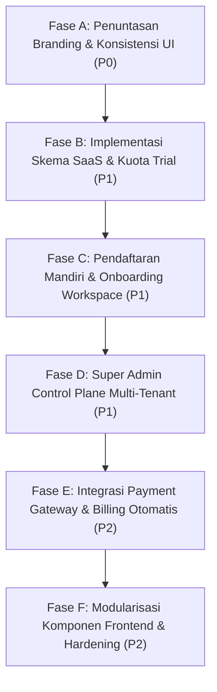

# RUANGKIRIM MASTER PROJECT STATUS

## Audit Date
2026-09-11T12:45:00+07:00 (Checkpoint: Phase 1G.6C.22 Post-Production Migration Baseline)

---

## Executive Summary

Audit komprehensif (read-only) ini dilakukan secara silang terhadap **Repository Lokal**, **Repository Remote GitHub (`mrifatsyauqi/ruangkirim`)**, dan **Runtime Live VPS Tencent Cloud (43.173.7.8)** untuk memetakan status aktual, integritas teknis, hutang arsitektur, dan kesiapan operasional platform **RUANGKIRIM**.

**Temuan Kunci Eksekutif:**
1. **Runtime & Isolasi WhatsApp (Phase 1G.6C.22):** **COMPLETE & HEALTHY**. Production (`ruangkirim.service`, port 3031) dan Staging (`ruangkirim-staging.service`, port 3032) beroperasi stabil. Sesi WhatsApp Agent 3 production telah berhasil dipindahkan ke direktori dedicated `/var/lib/ruangkirim/whatsapp/wa-session-agent-3.db` (+ wal, shm) dengan status terhubung aktif (`ESTABLISHED` ke WhatsApp CDN).
2. **Karakter Sistem Aktual vs Narasi Dokumen (CRITICAL FINDING):** Meskipun dokumen perancangan SaaS (Phase 1.1–1.2) di `docs/` merinci model langganan multi-tenant, runtime dan basis kode saat ini **masih beroperasi secara de facto sebagai aplikasi internal perusahaan (single-tenant default `id=1`)**.
   - Tidak ada tabel `plans`, `subscriptions`, atau `usages` di MySQL.
   - Fungsi pemeriksaan fitur `tenantPlanAllows()` dan `agentPlanAllows()` di-hardcode `return true` (semua fitur diizinkan tanpa batas).
   - Pembuatan agent di `backend/handlers/agents.go:1818` secara eksplisit mencantumkan: `// Tidak ada batas jumlah nomor — internal company`.
   - Endpoint pendaftaran publik (`/register`) **tidak ada** (`backend/handlers/auth.go:476: // Register tidak tersedia — instalasi internal perusahaan`).
   - Batasan uji coba 30 hari (*30-day trial*) dan batas maksimal 1 nomor (*max 1 sender*) **sama sekali belum diterapkan** di kode maupun skema database.
3. **Penyusupan Branding Warisan (Legacy Branding Leaks):** Ditemukan sisa branding **ChatLoop** dan **KirimWA** yang masih tampak langsung oleh pengguna akhir (*user-facing*):
   - Header dan sidebar Dashboard (`frontend/src/pages/Dashboard.tsx:1185`) masih menampilkan logo `logo-chatloop-1.png` dan teks judul **"ChatLoop"**.
   - Halaman Kebijakan Privasi (`Privacy.tsx`) dan Syarat Ketentuan (`Terms.tsx`) mencantumkan nama entitas **ChatLoop** dan email kontak `halo@chatloop.id`.
   - Modul Go utama di `go.mod` dan `package.json` masih bernama `kirimwa`.
4. **Konektivitas API & Frontend:** Ditemukan *dead hooks* dan endpoint fiktif, salah satunya `useUsage()` di `frontend/src/hooks.ts` yang memanggil `GET /api/usage` (rute ini tidak terdaftar di router Gin backend).

---

## Current Architecture

Platform RUANGKIRIM dirancang sebagai platform otomasi bisnis WhatsApp bertenaga AI dengan arsitektur:
- **Core Backend:** Go 1.25.8 menggunakan framework **Gin Web Framework** dan ORM **GORM**.
- **Database Utama:** **MySQL 8.0** (45 tabel di Production & Staging).
- **Session WhatsApp:** **whatsmeow** dengan storage lokal **SQLite WAL** per-agent, terisolasi di `/var/lib/ruangkirim/whatsapp/` (Production) dan `/var/lib/ruangkirim-staging/whatsapp/` (Staging).
- **AI & Vektor:** Provider **OpenRouter** (model LLM fleksibel) + model embedding OpenAI (`text-embedding-3-small`) dengan pencarian kemiripan kosinus (cosine similarity) langsung di memori/database tanpa vector DB eksternal terpisah.
- **Frontend SPA:** **React 18 / TypeScript / Vite** dengan komponen Material-UI (MUI), React Query (@tanstack/react-query), dan SweetAlert2.
- **Web Server / Reverse Proxy:** **Nginx 1.18.0** menangani SSL Termination (Certbot Let's Encrypt), proxy pass ke port 3031 (Production) dan port 3032 (Staging).

---

## Current Environment

| Parameter | Production | Staging | Legacy (ChatLoop) |
|---|---|---|---|
| **Domain** | `ruangkirim.web.id`, `www.ruangkirim.web.id` | `dev.ruangkirim.web.id` | N/A (Tidak ada vhost aktif) |
| **Systemd Unit** | `ruangkirim.service` | `ruangkirim-staging.service` | `chatloop.service` (Unit not found / Inactive) |
| **Status Service** | `active (running)` (PID 1713220) | `active (running)` (PID 1550755) | Inactive |
| **Internal Port** | `3031` (TCP LISTEN) | `3032` (TCP LISTEN) | `3030` (UNUSED / BEBAS) |
| **Health Endpoint** | `http://127.0.0.1:3031/health` (HTTP 200) | `http://127.0.0.1:3032/health` (HTTP 200) | N/A |
| **Source Path** | `/var/www/ruangkirim` | `/var/www/ruangkirim-staging` | `/var/www/chatloop` (Not found) |
| **Binary Path** | `/var/www/ruangkirim/ruangkirim-server` | `/var/www/ruangkirim-staging/ruangkirim-staging-server`| N/A |
| **Database** | `ruangkirim` (45 tabel) | `ruangkirim_staging` (45 tabel) | `db_wa_blast` / `kirimwa_staging` (Idle) |
| **WA Session Dir** | `/var/lib/ruangkirim/whatsapp` | `/var/lib/ruangkirim-staging/whatsapp` | N/A |
| **Active WA Agent**| Agent ID `3` (Nomor `6282211700060`, Connected) | Agent ID `1` (Nomor `6282211700060`, Connected) | N/A |

---

## Completed Checkpoints

- **Phase 1G.6C.21 (Audit Read-Only):** `COMPLETE`. Memverifikasi isolasi port, database, dan mengidentifikasi anomali storage sesi WhatsApp.
- **Phase 1G.6C.22 (WhatsApp Session Storage Isolation):** `COMPLETE`.
  - Kode di `backend/services/wa.go` mendukung `WA_SESSION_DIR`.
  - Unit test `backend/services/wa_session_test.go` lulus 100%.
  - Migrasi staging dan production selesai dan terverifikasi via `lsof`.
  - Sesi Agent 3 production tersambung kembali tanpa gangguan.
  - Backup dibuat di `/var/backups/ruangkirim/whatsapp-phase-1G-6C-22-20260911-130255`.
  - File lama di `/var/www/ruangkirim/data/wa-session-agent-3.db*` dipertahankan sebagai cadangan rollback sementara (tidak dibuka oleh proses apa pun).

---

## Branding / Rebrand / Legacy Identity Audit (Section 7A)

### 1. Status Identitas Merek
- **Identitas Merek Kanonik:** **RUANGKIRIM** (`Ruangkirim`).
- **Skor Kelengkapan Rebranding (Rebrand Completeness Score):** **42%**
  - *A. User-Facing Branding:* **45%** (Login & Title sudah Ruangkirim, tetapi Dashboard, Privacy, Terms, ApiPanel, WidgetPanel masih menampilkan ChatLoop).
  - *B. Source-Code Branding:* **20%** (Modul Go `kirimwa`, referensi paket `kirimwa/*`, DOM attributes `data-chatloop-role`).
  - *C. Infrastructure Naming:* **85%** (Service systemd `ruangkirim.service`, domain `ruangkirim.web.id`, storage `/var/lib/ruangkirim/`, database `ruangkirim`).
  - *D. Documentation Branding:* **40%** (Dokumen baru menggunakan Ruangkirim, dokumen lama penuh referensi ChatLoop & KirimWA).
  - *E. Repository/CI/CD Branding:* **75%** (Remote GitHub `mrifatsyauqi/ruangkirim`, workflow `deploy-ruangkirim.sh`, namun lokal workspace bernama `ngirimwa`).
  - *F. Visual Assets:* **25%** (Hanya 1 aset `logo-ruangkirim.png`, sedangkan 3 aset logo lainnya masih bernama `logo-chatloop-*`).

### 2. Branding Migration Matrix

| Legacy Reference | Location | Type | Current State | Should Become | Risk | Action |
|---|---|---|---|---|---|---|
| `logo-chatloop-1.png` | `frontend/src/assets/`, `Dashboard.tsx:33` | Asset & UI | Ditampilkan di Top Navbar Dashboard | `logo-ruangkirim.png` | Low | Ganti import aset di Dashboard |
| `ChatLoop` Text | `Dashboard.tsx:1185` | User-facing UI | Ditampilkan di sidebar/topbar | `Ruangkirim` | Low | Update label teks |
| `ChatLoop` Text | `Privacy.tsx`, `Terms.tsx` | User-facing Legal | Nama entitas & kontak legal | `Ruangkirim`, kontak `halo@ruangkirim.web.id` | Low | Update dokumen privasi & syarat |
| `data-chatloop-role` | `InboxPanel.tsx:2760,4429` | DOM Attribute | Selector testing/debug | `data-rk-role` / `data-ruangkirim-role` | Low | Refactor nanti saat UI cleanup |
| `chatloop_inbox_sound`| `Login.tsx:139`, `Dashboard.tsx:289` | LocalStorage Key | Pengaturan suara notifikasi | `ruangkirim_inbox_sound` (dengan fallback) | Low | Tambahkan migrasi key |
| `kirimwa` (Go Module) | `go.mod`, seluruh import backend | Internal Identifier | Nama modul Go utama | Tetap `kirimwa` / rename di fase refactor | High | **KEEP AS INTERNAL IDENTIFIER** |
| `kirimwa` (package.json)| `package.json:2` | Package Meta | Nama paket Node | `ruangkirim` | Low | Update package.json |
| `CHATLOOP_API_KEY` | `ApiPanel.tsx:228,757` | UI / Documentation | Contoh snippet kode integrasi | `RUANGKIRIM_API_KEY` | Low | Update template snippet |
| `super@wa-assistant.local`| `database.go:1010` | Seeder default email | Email default user superadmin | `admin@ruangkirim.web.id` | Low | Update seeder |
| `noreply@chatloop.id`| `email.go:22`, `verify.go:133` | Email Service | Default alamat pengirim & link | `noreply@ruangkirim.web.id` | Medium | Update default config email |
| `ngirimwa` | Git local folder & remotes | Local Workspace | Nama folder workspace lokal | Biarkan / sesuaikan remote | Low | Tidak perlu rewrite Git history |

### 3. Final Branding Verdict
1. **Apakah RUANGKIRIM identitas resmi saat ini?** YA, secara kanonik.
2. **Apakah brand lama masih terlihat oleh pengguna akhir?** YA (Logo & nama ChatLoop di Dashboard, CheckEmail, Privacy, Terms, ApiPanel).
3. **Apakah ChatLoop terisolasi?** YA, port 3030 tidak aktif, unit systemd tidak ada, direktori `/var/www/chatloop` tidak ada di server.
4. **Apakah referensi KirimWA masih ada?** YA, di modul Go (`go.mod`), import paket, dan metadata npm.
5. **Apakah referensi NgirimWA masih ada?** YA, di nama direktori workspace lokal dan beberapa dokumen historis.
6. **Apakah ada domain lama?** YA, fallback link email masih mengarah ke `https://chatloop.id`.
7. **Apakah ada service lama?** TIDAK, service aktif hanya `ruangkirim.service` dan `ruangkirim-staging.service`.
8. **Apakah ada database/path lama?** Database historis `db_wa_blast` dan `kirimwa_staging` masih tersimpan di MySQL (idle).
9. **Konflik branding production vs staging?** Tidak ada konflik struktural, keduanya memakai pola yang sama.
10. **Apa yang aman di-rename segera?** Label teks UI, import aset logo di Dashboard, template email, dan teks Privacy/Terms.
11. **Apa yang TIDAK boleh di-rename sekarang?** Modul Go (`go.mod`), nama database production/staging, dan struktur folder sistem.

---

## Backend Status

- **Status:** **PARTIAL** (Confidence: HIGH)
- **Kekuatan:**
  - Routing Gin terstruktur dengan baik (auth, public, webhook, rest api v1, crm, inbox).
  - Isolasi sesi WhatsApp multi-agent berjalan mulus via whatsmeow dan SQLite WAL.
  - Implementasi rate limiting dan login brute-force sweeper (`login_throttles`).
  - Fitur rich-messaging WhatsApp: Teks, media, vCard, delay manusia, spintext, button interactive.
- **Kelemahan Arsitektural:**
  - Logic multi-tenant belum diterapkan pada level SaaS billing/kuota; masih memakai mindset instalasi internal tunggal.
  - Skema database dan model tidak memiliki relasi `Tenant` pada entitas chat langsung (bergantung pada relasi bertingkat via `Agent`).
  - Tidak ada endpoint registrasi publik (`/api/register`).

### Backend Module Map

| Modul / File | Tanggung Jawab | Dependensi | Status | Risiko Utama |
|---|---|---|---|---|
| `backend/main.go` | Inisialisasi router Gin, HTTP server, background sweeper | Gin, Handlers, Database, Config | DONE | Port fallback 3030 |
| `backend/database/database.go`| Koneksi MySQL, GORM AutoMigrate 45 tabel, seeder | GORM, MySQL Driver, BCrypt | DONE | AutoMigrate dijalankan saat startup |
| `backend/services/wa.go` | Core WhatsApp client (whatsmeow), SQLite isolation | whatsmeow, SQLite3, Config | DONE | Lock SQLite jika proses hang |
| `backend/services/ai.go` | OpenRouter API integration, RAG cosine similarity | go-openai, Database, Models | DONE | Ketergantungan API key pihak ketiga |
| `backend/services/embedding.go`| Generator vektor embedding & in-memory cache | go-openai, Database | DONE | Memori konsumsi jika cache membengkak |
| `backend/handlers/auth.go` | Login, JWT claims, CSRouteGuard, password reset | JWT, BCrypt, Database | PARTIAL | Registrasi publik tidak ada |
| `backend/handlers/agents.go` | CRUD WhatsApp agents, QR code connect, pairing code | Services WA, Database | DONE | Tidak ada pembatasan jumlah agen |
| `backend/handlers/chat.go` | Fetch riwayat chat, kirim pesan manual CS | Services WA, Database | DONE | Chat query berat jika tanpa filter waktu |
| `backend/handlers/followup.go` | Follow-up sequence engine, stop-on-reply | Services WA, Schedule, Database | DONE | Cron polling tiap menit |
| `backend/handlers/broadcast.go`| WhatsApp broadcast / blast engine, delay, rotasi | Services WA, Database | DONE | Risiko blokir nomor dari pihak WhatsApp |
| `backend/handlers/plan_features.go`| Gating fitur & kuota paket langganan | - | MOCK / NO-OP | Hardcoded `return true` |

---

## Frontend Status

- **Status:** **PARTIAL** (Confidence: HIGH)
- **Framework & Libraries:** React 18, Vite, Material UI (v5), TanStack Query (v5), SweetAlert2.
- **Observasi Halaman & Komponen:**
  - `Login.tsx`: **DONE** (Sudah memakai branding Ruangkirim, mockup chat responsif, integrasi Turnstile).
  - `Dashboard.tsx`: **PARTIAL** (Fungsionalitas inbox, kontak, kampanye jalan, namun header/sidebar masih memakai branding ChatLoop).
  - `InboxPanel.tsx`: **DONE** (Komponen sangat komprehensif: streaming cursor polling, audio notification, filter read/unread, tag/label, reply, attachment).
  - `Billing / Subscription UI`: **NOT STARTED** (Tidak ada halaman atau komponen paket/tagihan di frontend).
  - `Super Admin UI`: **NOT STARTED** (Tidak ada panel kontrol pengelolaan tenant/user multi-organisasi).
  - `Dead / Disconnected Code`: `useUsage()` di `hooks.ts` memanggil endpoint `/api/usage` yang tidak ada.

---

## Database Status

- **Status:** **FULL FEATURE PATH (untuk Core single-tenant) / SCHEMA ONLY (untuk SaaS multi-tenant)** (Confidence: HIGH)
- **Jumlah Tabel:** Tepat **45 tabel** di Production (`ruangkirim`) dan Staging (`ruangkirim_staging`).
- **Integritas:** Bersih, tidak ada migrasi menggantung, skema `follow_ups` terverifikasi bebas dari kolom usang `sender`.
- **Klasifikasi Seluruh 45 Tabel:**

| No | Nama Tabel | Terisi di Prod | Terkait Model / Handler | Status Fungsional |
|---|---|---|---|---|
| 1 | `agents` | 1 row | `models.Agent` / `handlers.agents` | FULL FEATURE PATH |
| 2 | `ai_forms` | 2 rows | `models.AIForm` / `handlers.ai_form` | FULL FEATURE PATH |
| 3 | `ai_form_sessions` | 1 row | `models.AIFormSession` / `handlers.ai_form` | FULL FEATURE PATH |
| 4 | `ai_form_submissions` | 1 row | `models.AIFormSubmission` / `handlers.ai_form` | FULL FEATURE PATH |
| 5 | `ai_turns` | 19 rows | `models.AITurn` / `handlers.ai_metrics` | FULL FEATURE PATH |
| 6 | `app_settings` | 4 rows | `models.AppSetting` / `handlers.api_config` | FULL FEATURE PATH |
| 7 | `auto_replies` | 0 rows | `models.AutoReply` / `handlers.autoreply` | FULL FEATURE PATH |
| 8 | `broadcasts` | 0 rows | `models.Broadcast` / `handlers.broadcast` | FULL FEATURE PATH |
| 9 | `broadcast_recipients` | 0 rows | `models.BroadcastRecipient` / `handlers.broadcast` | FULL FEATURE PATH |
| 10 | `chat_histories` | 29,941 rows | `models.ChatHistory` / `handlers.chat` | FULL FEATURE PATH (Aktif) |
| 11 | `chat_labels` | 1 row | `models.ChatLabel` / `handlers.labels_groups` | FULL FEATURE PATH |
| 12 | `closing_forms` | 0 rows | `models.ClosingForm` / `handlers.closing` | BACKEND CONNECTED |
| 13 | `closing_records` | 0 rows | `models.ClosingRecord` / `handlers.closing` | BACKEND CONNECTED |
| 14 | `contact_consents` | 0 rows | `models.ContactConsent` / `handlers.broadcast` | BACKEND CONNECTED |
| 15 | `contacts` | 532 rows | `models.Contact` / `handlers.contacts` | FULL FEATURE PATH (Aktif) |
| 16 | `conversation_memories` | 2 rows | `models.ConversationMemory` / `services.ai` | FULL FEATURE PATH |
| 17 | `crawl_jobs` | 0 rows | `models.CrawlJob` / `handlers.crawl` | FULL FEATURE PATH |
| 18 | `crawl_pages` | 0 rows | `models.CrawlPage` / `handlers.crawl` | FULL FEATURE PATH |
| 19 | `cs_activity_logs` | 44 rows | `models.CSActivityLog` / `handlers.team` | FULL FEATURE PATH |
| 20 | `flow_sessions` | 0 rows | `models.FlowSession` / `handlers.flow` | FULL FEATURE PATH |
| 21 | `flows` | 0 rows | `models.Flow` / `handlers.flow` | FULL FEATURE PATH |
| 22 | `follow_ups` | 0 rows | `models.FollowUp` / `handlers.followup` | FULL FEATURE PATH |
| 23 | `follow_up_steps` | 0 rows | `models.FollowUpStep` / `handlers.followup` | FULL FEATURE PATH |
| 24 | `follow_up_enrollments`| 0 rows | `models.FollowUpEnrollment` / `handlers.followup` | FULL FEATURE PATH |
| 25 | `group_guard_configs` | 0 rows | `models.GroupGuardConfig` / `handlers.group_guard` | FULL FEATURE PATH |
| 26 | `group_moderation_logs`| 0 rows | `models.GroupModerationLog` / `handlers.group_guard`| FULL FEATURE PATH |
| 27 | `handoffs` | 0 rows | `models.Handoff` / `handlers.handoff` | FULL FEATURE PATH |
| 28 | `inbox_read_states` | 5,163 rows | `models.InboxReadState` / `handlers.inbox_events` | FULL FEATURE PATH (Aktif) |
| 29 | `knowledges` | 13 rows | `models.Knowledge` / `handlers.knowledge` | FULL FEATURE PATH (Aktif) |
| 30 | `labels` | 11 rows | `models.Label` / `handlers.labels_groups` | FULL FEATURE PATH |
| 31 | `login_throttles` | 2 rows | `models.LoginThrottle` / `handlers.auth` | FULL FEATURE PATH |
| 32 | `meta_conversion_events`| 0 rows | `models.MetaConversionEvent` / `handlers.meta_tracking` | BACKEND CONNECTED |
| 33 | `opt_outs` | 0 rows | `models.OptOut` / `handlers.broadcast` | FULL FEATURE PATH |
| 34 | `otp_codes` | 0 rows | `models.OTPCode` / `handlers.api_otp` | BACKEND CONNECTED |
| 35 | `product_checkout_sessions`| 0 rows | `models.ProductCheckoutSession` / `handlers.product_checkout` | BACKEND CONNECTED |
| 36 | `product_orders` | 0 rows | `models.ProductOrder` / `handlers.product` | FULL FEATURE PATH |
| 37 | `products` | 0 rows | `models.Product` / `handlers.product` | FULL FEATURE PATH |
| 38 | `scheduled_messages` | 0 rows | `models.ScheduledMessage` / `handlers.schedule` | FULL FEATURE PATH |
| 39 | `scheduled_statuses` | 0 rows | `models.ScheduledStatus` / `handlers.status` | FULL FEATURE PATH |
| 40 | `settings` | 0 rows | `models.Setting` / `handlers.settings` | BACKEND CONNECTED |
| 41 | `shipping_cities` | 0 rows | `models.ShippingCity` / `services.shipping` | BACKEND CONNECTED |
| 42 | `templates` | 0 rows | `models.Template` / `handlers.template` | FULL FEATURE PATH |
| 43 | `tenants` | 1 row | `models.Tenant` / `handlers.auth` | BACKEND CONNECTED (Single Default) |
| 44 | `user_agent_assignments`| 0 rows | `models.UserAgentAssignment` / `handlers.team` | FULL FEATURE PATH |
| 45 | `users` | 1 row | `models.User` / `handlers.auth` | FULL FEATURE PATH (Superadmin) |

---

## Authentication Status

- **Status:** **PARTIAL** (Confidence: HIGH)
- **Registrasi Publik:** **NOT STARTED / DISABLED**. Tidak ada endpoint `/api/register` maupun form sign-up. Akun hanya bisa dibuat lewat CLI/seeder atau undangan admin tim.
- **Login:** **DONE**. Menggunakan identifikasi username/password dengan BCrypt cost default, JWT claims HS256, dan validasi `active = true`.
- **Proteksi Brute-force:** **DONE**. Throttle berbasis IP dan username menggunakan tabel `login_throttles` dan sweeper berkala.
- **Lupa Password & Verifikasi Email:** **PARTIAL**. Handler backend ada (`/api/forgot-password`, `/api/verify-email`), namun template pengirim email default masih mengarah ke `noreply@chatloop.id` dan `https://chatloop.id`.
- **Google OAuth:** **NOT STARTED**. Hanya ada komentar `TODO` di `Login.tsx`.

---

## Tenant / SaaS Status

- **Status:** **NOT STARTED / PROTO-FOUNDATION** (Confidence: HIGH)
- **Evaluasi Kebutuhan Produk:**
  - *Kebutuhan:* "FIRST REGISTRATION TRIAL = 30 DAYS, MAX 1 SENDER".
  - *Kenyataan di Kode:* **TIDAK ADA**.
    - Model `Tenant` hanya memiliki field: `ID`, `Name`, `CreatedAt`, `UpdatedAt`.
    - Tidak ada field `TrialEndsAt`, `PlanID`, `Status`, atau `MaxAgents`.
    - Di `backend/handlers/agents.go:1818`: tidak ada validasi jumlah nomor.
    - Di `backend/handlers/plan_features.go`: semua izin mengembalikan nilai `true`.
- **Isolasi Query:** Handlers memeriksa `currentTenantID(c)` dan memastikan `agents.tenant_id = currentTenantID`, tetapi karena sistem berjalan dengan 1 tenant default (`id=1`), pengujian multi-tenant lintas organisasi belum terbukti di runtime produksi.

---

## WhatsApp Status

- **Status:** **DONE** (Confidence: HIGH)
- **Library Engine:** `github.com/tulir/whatsmeow`.
- **Storage Path:** `/var/lib/ruangkirim/whatsapp/wa-session-agent-{agentID}.db` (Terverifikasi aktif di Production via `lsof`).
- **Koneksi Live:** Agent 3 production tersambung aktif (`ESTABLISHED`) ke WhatsApp servers tanpa terputus.
- **Fitur Terverifikasi:**
  - QR Code login stream via WebSocket/polling.
  - 8-digit Pairing Code login.
  - Auto-reconnect watchdog (interval 30 detik).
  - Sinkronisasi riwayat pesan dan kontak.
  - Multi-agent isolation (database SQLite mandiri per Agent ID).

---

## Inbox Status

- **Status:** **DONE** (Confidence: HIGH)
- **Trafik Live:** Berjalan aktif dengan 29.941 rekaman pesan di produksi.
- **Pola Sinkronisasi:** Polling cursor dinamis (`/api/agents/3/inbox/incoming-cursor?after_id=...`) setiap 3 detik dari browser pengguna, dipadukan dengan tracking `inbox_read_states`.
- **Fitur:**
  - Pengiriman teks, gambar, video, dokumen, audio, vCard.
  - Reply context (membalas pesan tertentu).
  - Revoke pesan (hapus untuk semua orang).
  - Deteksi status pengetikan (typing presence).
  - Penandaan pesan terbaca/belum dibaca.

---

## AI Status

- **Status:** **DONE** (Confidence: HIGH)
- **Provider LLM:** OpenRouter (mendukung berbagai model seperti Claude, GPT-4o, Gemini, DeepSeek).
- **RAG Engine:**
  - Menggunakan vektor `text-embedding-3-small` (1536 dimensi).
  - Pencarian kemiripan kosinus dengan threshold dinamis (`simThreshold = 0.45`, `simFloor = 0.32`).
  - Cache knowledge in-memory per-agent dengan mekanisme invalidasi (`InvalidateKB`).
- **Fitur Otomatisasi AI:**
  - Debounce 5 detik untuk menggabungkan pesan bertubi-tubi dari pelanggan.
  - Form AI (`ai_forms`) untuk pengumpulan data interaktif (leads/order).
  - Vision Workflow (analisis gambar/bukti transfer menggunakan multimodal LLM).
  - Fallback aman jika API error (mengalihkan ke CS atau memberikan respons ramah).

---

## Automation Status

- **Status:** **DONE** (Confidence: HIGH)
- **Follow-up Sequence:**
  - Skema tabel: `follow_ups`, `follow_up_steps`, `follow_up_enrollments`.
  - Terverifikasi bersih: **Tidak ada kolom usang `sender`**.
  - Background worker: `processDueFollowUps()` berjalan tiap menit melalui scheduler.
  - Fitur `stop_on_reply`: Otomatis menghentikan follow-up saat prospek mengirim balasan.
- **Broadcast / Blast:**
  - Jeda acak (*human delay*) antar pengiriman pesan.
  - Perlindungan anti-banned dengan kuota dan jeda otomatis saat menerima sinyal peringatan dari WhatsApp.
  - Rotasi nomor pengirim multi-agen (`broadcast_rotation.go`).
- **Jadwal & Auto-Reply:** Pesan terjadwal dan auto-reply berbasis kata kunci/regex beroperasi normal.

---

## Billing Status

- **Status:** **NOT STARTED / DEFERRED** (Confidence: HIGH)
- Tidak ada integrasi payment gateway (Midtrans, Xendit, Stripe, Tripay, dll).
- Tidak ada tabel invoice, pembayaran, riwayat transaksi, ataupun webhook callback pembayaran.
- Tidak ada sistem pembuatan tagihan otomatis atau downgrade/upgrade paket.

---

## Admin Status

- **Status:** **PARTIAL** (Confidence: HIGH)
- **Tingkat Super Admin:**
  - Flag `is_super_admin` pada user ID 1.
  - Super admin saat ini hanya digunakan untuk mengonfigurasi API key global OpenRouter dan model AI di `/api/settings/api-config`.
- **Tingkat Tim / CS:**
  - Manajemen anggota CS (`/api/team/users`), penugasan nomor WhatsApp (`user_agent_assignments`), dan audit aktivitas CS (`cs_activity_logs`).
- **Kekurangan:** Tidak ada antarmuka atau endpoint untuk mengelola daftar tenant, melihat statistik platform secara global, atau menangguhkan (*suspend*) akun pelanggan.

---

## Security Status

- **Autentikasi & Password:** **PRESENT / SECURE**. Password di-hash menggunakan BCrypt. Token JWT menggunakan HMAC-SHA256 dengan secret aman.
- **Brute Force Protection:** **PRESENT**. Throttle login membatasi percobaan gagal per IP dan per username.
- **Tenant Isolation:** **PRESENT (Application-level)**. Mayoritas handler memvalidasi `currentTenantID(c)`. Namun, beberapa tabel (`chat_histories`, `knowledges`) tidak memiliki kolom `tenant_id` langsung dan bergantung pada relasi `agent_id`.
- **File & Storage Permissions:** **PRESENT / SECURE**. Direktori WhatsApp `/var/lib/ruangkirim/whatsapp` diatur ketat ke `0750 ubuntu:ubuntu`.
- **CORS & HTTP Limits:** **PRESENT**. Body size request dibatasi (`handlers.BodySizeLimit`), CORS diatur via handler.
- **Secrets Exposure:** **SECURE**. File `.env` tidak ter-track di Git, variabel sensitif tidak dicetak di log.
- **Area Perbaikan:** CSP (Content Security Policy) belum dikonfigurasi lengkap di Nginx; cookie session belum dipakai (masih localStorage).

---

## DevOps Status

- **CI/CD:** GitHub Actions workflow `deploy-production.yml` dan script `/usr/local/bin/deploy-ruangkirim.sh` di server.
- **Systemd Service Sandboxing:**
  - `ruangkirim.service` menggunakan `NoNewPrivileges=true`, `PrivateTmp=true`, `ProtectSystem=full`, `ProtectHome=true`.
- **Nginx & SSL:** Let's Encrypt Certbot terpasang dengan auto-renewal, SSL protocols TLSv1.2 & TLSv1.3.
- **Environment Parity:**
  - Production (3031) dan Staging (3032) berjalan berdampingan pada VPS yang sama dengan database dan storage sesi WhatsApp yang terisolasi penuh.
- **Backup:** Tersedia backup konsisten di `/var/backups/ruangkirim/`.

---

## API ↔ Frontend Connectivity

| Fitur | UI (Frontend) | API Endpoint | Handler Backend | Tabel DB Terkait | Runtime Status | Keterangan |
|---|---|---|---|---|---|---|
| **Login** | `Login.tsx` | `POST /api/login` | `handlers.Login` | `users`, `login_throttles` | **DONE** | Bekerja sempurna di produksi |
| **Registrasi** | Tidak ada | Tidak ada | Tidak ada | - | **NOT STARTED** | Belum ada flow pendaftaran mandiri |
| **Profil User** | Dialog di `Dashboard.tsx` | `GET /api/me`, `PUT /api/profile`| `handlers.Me`, `handlers.UpdateProfile` | `users` | **DONE** | Mengubah nama & nomor telepon |
| **Koneksi WhatsApp**| `Dashboard.tsx` (QR Dialog)| `POST /api/agents/:id/wa/connect`| `handlers.ConnectNumber` | `agents` | **DONE** | QR code & pairing code jalan |
| **Inbox & Percakapan**| `InboxPanel.tsx` | `GET /api/agents/:id/conversation` | `handlers.InboxConversation` | `chat_histories`, `contacts`| **DONE** | Aktif digunakan di produksi |
| **Kirim Pesan CS** | `InboxPanel.tsx` | `POST /api/agents/:id/send` | `handlers.InboxSend` | `chat_histories` | **DONE** | Berhasil kirim pesan WhatsApp |
| **Basis Pengetahuan** | Tab Asisten AI | `GET/POST /api/agents/:id/knowledge` | `handlers.List/CreateKnowledge` | `knowledges` | **DONE** | CRUD knowledge & embedding jalan |
| **Follow-up Flow** | `FollowUpPanel.tsx` | `GET/POST /api/agents/:id/follow-ups` | `handlers.List/CreateFollowUp` | `follow_ups`, `follow_up_steps`| **DONE** | UI terhubung ke backend |
| **Blast Kampanye** | `BroadcastPanel.tsx` | `POST /api/agents/:id/broadcast` | `handlers.CreateBroadcast` | `broadcasts`, `broadcast_recipients`| **DONE** | UI terhubung ke backend |
| **Pengguna Tim CS** | `TeamPanel.tsx` | `GET/POST /api/team/users` | `handlers.List/CreateTeamUser` | `users`, `user_agent_assignments`| **DONE** | Pengelolaan akun operator CS |
| **Penggunaan / Limit** | `hooks.ts:1906` (`useUsage`) | `GET /api/usage` | **TIDAK ADA** | **TIDAK ADA** | **BROKEN / DEAD** | Hook frontend memanggil API mati |
| **Billing & Paket** | Tidak ada | Tidak ada | `handlers.plan_features` (Mock) | **TIDAK ADA** | **MOCK / NOT STARTED**| Tidak ada UI tagihan/langganan |
| **Super Admin Platform**| Tidak ada | `PUT /api/settings/api-config` | `handlers.SaveAPIConfig` | `app_settings` | **PARTIAL** | Hanya untuk set API key AI global |

---

## Master Feature Matrix

### CORE
- Autentikasi Login: **DONE**
- Registrasi Mandiri: **NOT STARTED**
- Logout: **DONE**
- Tenant Onboarding: **NOT STARTED**
- Dashboard Ringkasan: **DONE**
- WhatsApp Sender / Multi-Agent: **DONE**
- QR Login & Pairing Code: **DONE**
- Connection Status / Watchdog: **DONE**
- Inbox Realtime & History: **DONE**
- Pengiriman & Penerimaan Pesan: **DONE**
- Manajemen Kontak: **DONE**
- Notifikasi Audio: **DONE**

### AI
- AI Assistant Auto-Reply: **DONE**
- Prompt & Tone Configuration: **DONE**
- Knowledge Base & Vektor RAG: **DONE**
- Web Scraping / Crawler Trainer: **DONE**
- AI Form Generator: **DONE**
- Multimodal Vision Workflow: **DONE**
- Quota / Token Gating: **NOT STARTED**

### SAAS
- Katalog Paket (*Plans*): **NOT STARTED**
- Free Trial 30 Hari: **NOT STARTED**
- Batasan 1 Nomor pada Trial: **NOT STARTED**
- Subscription Tracking: **NOT STARTED**
- Usage Quota Enforcement: **NOT STARTED**
- Payment Gateway Integration: **NOT STARTED**
- Upgrade / Downgrade Plan: **NOT STARTED**

### AUTOMATION
- Follow-up Sequence Engine: **DONE**
- Trigger & Delay Hours: **DONE**
- Stop on Reply: **DONE**
- Background Poller (1-min): **DONE**
- Blast Broadcast with Rotation: **DONE**
- Pesan & Status Terjadwal: **DONE**

### ADMIN
- Super Admin Auth: **PARTIAL**
- Konfigurasi AI Global: **DONE**
- Tenant Management: **NOT STARTED**
- Subscription Management: **NOT STARTED**
- Platform Audit Logs: **NOT STARTED**
- Suspensi / Deaktivasi Tenant: **NOT STARTED**

### INFRASTRUCTURE
- Production VPS Setup (Port 3031): **DONE**
- Staging VPS Setup (Port 3032): **DONE**
- CI/CD Deployment: **DONE**
- Nginx & SSL Let's Encrypt: **DONE**
- Systemd Sandboxing & Restart: **DONE**
- SQLite WhatsApp Storage Isolation: **DONE**
- Backup System: **DONE**
- ChatLoop Isolation (Port 3030 Unused): **DONE**

---

## Technical Debt

### P0 — Critical Technical Debt
1. **User-Facing Branding Inconsistency:** Topbar dan Sidebar `Dashboard.tsx` masih mengimpor dan menampilkan nama dan logo `ChatLoop`.
2. **Tidak Adanya Enforcing Trial & Sender Limit:** Belum ada kontrol kode yang membatasi 30 hari trial atau 1 sender.
3. **Dead Hook API:** Hook `useUsage()` memanggil rute tidak ada (`GET /api/usage`).

### P1 — High Priority Technical Debt
1. **Mindset Single-Tenant di Kode:** Kode inti masih mengasumsikan instalasi internal tunggal (`TenantID = 1`).
2. **Ketiadaan Modul Registrasi & Onboarding:** Pengguna baru belum bisa membuat akun atau workspace secara mandiri.
3. **Port Fallback Default:** `backend/main.go:269` fallback ke port `3030` (port historis ChatLoop) jika env var tidak terbaca. Seharusnya fallback ke `3031` (Production) atau `3032` (Staging).

### P2 — Medium Priority Technical Debt
1. **Nama Modul Go `kirimwa`:** Seluruh file backend mengimpor `kirimwa/backend/*`.
2. **Komponen Raksasa (*Monolithic UI Files*):** `Dashboard.tsx` (~1300 baris) dan `InboxPanel.tsx` (~4500 baris).
3. **Template Email Default:** Fallback URL email masih mengarah ke `https://chatloop.id`.

### P3 — Low Priority Technical Debt
1. **File Cadangan Sesi Lama:** File rollback di `/var/www/ruangkirim/data/wa-session-agent-3.db*` masih ada di server (perlu dibersihkan setelah masa observasi).
2. **Database Warisan di MySQL:** Database `db_wa_blast` dan `kirimwa_staging` masih ada di instance MySQL.

---

## Critical Risks

1. **Risiko Integritas Merek:** Pelanggan yang login langsung melihat brand "ChatLoop", menimbulkan kebingungan identitas bagi platform "Ruangkirim".
2. **Risiko Eksploitasi Multi-Nomor:** Tanpa pembatasan jumlah agent per tenant, pengguna dapat membuat agen tanpa batas di database (`CreateAgent` tidak memiliki kuota).
3. **Risiko AutoMigrate di Startup:** Database production dijalankan dengan `AutoMigrate` pada saat startup server. Perubahan skema masa depan yang salah di model GORM dapat mengubah tabel live secara otomatis.

---

## P0 Priorities

1. **Perbaikan User-Facing Branding Dashboard:** Ganti import aset logo dan teks `ChatLoop` di `Dashboard.tsx` menjadi `Ruangkirim`.
2. **Perbaikan Teks Legal & Privacy:** Ganti penyebutan entitas dan email di `Privacy.tsx` dan `Terms.tsx`.
3. **Hapus / Perbaiki Dead Hook `useUsage`:** Hapus atau sambungkan ke endpoint backend yang valid.

---

## P1 Priorities

1. **Implementasi Skema SaaS Phase 1.1:** Tambahkan field `trial_ends_at`, `status`, dan tabel `plans` / `subscriptions`.
2. **Enforcement 30-Day Trial & Max 1 Sender:** Pasang validasi di `CreateAgent` dan middleware request.
3. **Implementasi Public Registration & Workspace Onboarding:** Buat endpoint `/api/register` dan wizard pendaftaran tenant baru.

---

## P2 Priorities

1. **Pembersihan Default Email & Fallback Domain:** Arahkan semua default string ke `ruangkirim.web.id`.
2. **Pembersihan Database & File Warisan:** Hapus database `db_wa_blast`, `kirimwa_staging`, dan hapus file sesi lama `/var/www/ruangkirim/data/` setelah stabilitas teruji 14 hari.

---

## Recommended Roadmap

### PHASE A — Penuntasan Branding & Konsistensi UI
- **Objektif:** Menghilangkan 100% sisa visual ChatLoop di antarmuka pengguna.
- **File Terlibat:** `frontend/src/pages/Dashboard.tsx`, `frontend/src/pages/Privacy.tsx`, `frontend/src/pages/Terms.tsx`, `frontend/src/pages/CheckEmail.tsx`, `frontend/src/assets/`.
- **Kriteria Penerimaan:** Tidak ada satupun teks atau logo "ChatLoop" yang terlihat di seluruh alur UI.

### PHASE B — SaaS Foundation & Trial Enforcement
- **Objektif:** Menerapkan pembatasan Trial 30 hari dan maksimal 1 nomor WhatsApp untuk tenant baru.
- **File Terlibat:** `backend/models/saas.go`, `backend/handlers/agents.go`, `backend/handlers/plan_features.go`, `backend/database/database.go`.
- **Kriteria Penerimaan:** Upaya membuat agen ke-2 pada akun trial ditolak dengan pesan error yang jelas; akun melewati 30 hari ditangguhkan fiturnya.

### PHASE C — Public Registration & Multi-Tenant Onboarding
- **Objektif:** Membuka akses bagi pengguna umum untuk mendaftar akun baru dan membuat workspace secara otomatis.
- **File Terlibat:** `backend/handlers/auth.go`, `frontend/src/pages/Register.tsx`, `frontend/src/App.tsx`.
- **Kriteria Penerimaan:** Calon pengguna bisa sign up, memverifikasi email, dan langsung mendapatkan tenant ID unik dengan status Trial 30 hari.

---

## Deferred Items

1. **Penggantian Nama Modul Go (`kirimwa` -> `ruangkirim`):** Ditunda karena berisiko tinggi merusak import ratusan file tanpa memberikan nilai tambah langsung bagi pengguna akhir.
2. **Integrasi Payment Gateway:** Ditunda sampai fondasi kuota trial dan registrasi multi-tenant stabil.
3. **Pembersihan File Sesi Lama di Server:** Ditunda hingga masa observasi 14 hari pasca-migrasi Phase 1G.6C.22 selesai.

---

## Documentation Gaps

| Dokumen | Status Aktual | Catatan Konsistensi |
|---|---|---|
| `docs/AUDIT-PHASE-1G.6C.21.md` | **CURRENT** | Audit read-only akurat sebelum migrasi sesi |
| `docs/IMPLEMENTATION-PHASE-1G.6C.22.md` | **CURRENT** | Spesifikasi implementasi isolasi sesi |
| `docs/SAAS-DOMAIN-MODEL.md` | **PLANNED** | Rencana model SaaS, belum diimplementasikan di kode |
| `docs/SAAS-PHASE-1.1-DATABASE-MIGRATION-SPEC.md` | **PLANNED** | Rencana skema database SaaS, belum dijalankan di MySQL |
| `docs/SAAS-SUBSCRIPTION-ROADMAP.md` | **PLANNED** | Roadmap konseptual, belum ada kode pembayaran |
| `docs/AUTHENTICATION.md` | **OUTDATED** | Mengasumsikan instalasi perusahaan internal |
| `docs/PROJECT-MAP.md` | **OUTDATED** | Masih banyak mencantumkan path dan nama KirimWA/ChatLoop |

---

## Evidence

1. **Systemd Runtime:**
   - `systemctl status ruangkirim.service` ➔ PID 1713220, Active, port 3031.
   - `systemctl status ruangkirim-staging.service` ➔ PID 1550755, Active, port 3032.
2. **Storage Open Files:**
   - `lsof -p 1713220` ➔ Membuka `/var/lib/ruangkirim/whatsapp/wa-session-agent-3.db` (+ wal, shm).
   - `lsof /var/www/ruangkirim/data/wa-session-agent-3.db` ➔ `CONFIRMED_NOT_OPEN`.
3. **Database Inspection:**
   - `SELECT table_name FROM information_schema.tables WHERE table_schema = 'ruangkirim'` ➔ Tepat 45 tabel.
   - `DESCRIBE tenants` ➔ Hanya kolom `id`, `name`, `created_at`, `updated_at`.
   - `SELECT COUNT(*) FROM tenants` ➔ 1 row (`id=1, name='Default'`).
4. **Source Code Inspection:**
   - `backend/handlers/auth.go:476` ➔ Registrasi publik eksplisit tidak tersedia.
   - `backend/handlers/agents.go:1818` ➔ Batas jumlah nomor eksplisit tidak ada.
   - `backend/handlers/plan_features.go:12` ➔ Gating fitur selalu `return true`.
   - `frontend/src/pages/Dashboard.tsx:1185` ➔ Teks "ChatLoop" masih aktif di navbar.

---

## Audit Limitations

- Audit dilakukan secara non-destruktif dan read-only (tidak mengubah kode, database, ataupun konfigurasi live).
- Uji coba pengiriman pesan broadcast massal tidak dieksekusi selama audit untuk menjaga reputasi nomor WhatsApp aktif milik user.
- Pengujian multi-tenant sejati dibatasi oleh fakta bahwa database produksi dan staging saat ini hanya memiliki 1 data tenant aktif (`id=1`).

---

## Phase 2A — Branding Consolidation (Execution & Verification)

- **Tanggal Eksekusi:** 11 September 2026
- **Status:** **STAGING VERIFIED — PENDING USER APPROVAL FOR PRODUCTION**
- **Git Commit:** `f4f8075` (branch `develop`, upstream `ruangkirim/develop`)

### Ringkasan Perubahan Branding

1. **Frontend User-Facing Identity:**
   - `frontend/src/pages/Dashboard.tsx`: Mengganti logo ke `logo-ruangkirim.png`, teks dan alt ke `Ruangkirim`, migrasi kunci suara notifikasi ke `ruangkirim_inbox_sound` dengan fallback baca/tulis ke `chatloop_inbox_sound`.
   - `frontend/src/pages/CheckEmail.tsx`: Mengganti import logo ke `logo-ruangkirim.png`, alt text ke `Ruangkirim`.
   - `frontend/src/pages/Privacy.tsx`: Mengganti logo ke `logo-ruangkirim.png`, seluruh penyebutan merek ke `Ruangkirim`, email kontak ke `halo@ruangkirim.web.id`, hak cipta ke `Ruangkirim`.
   - `frontend/src/pages/Terms.tsx`: Mengganti logo ke `logo-ruangkirim.png`, seluruh penyebutan merek ke `Ruangkirim`, email kontak ke `halo@ruangkirim.web.id`, hak cipta ke `Ruangkirim`.
   - `frontend/src/pages/Login.tsx`: Mengadopsi pengecekan suara dengan fallback transparan.
   - `frontend/src/components/InboxPanel.tsx`: Empty state title diubah menjadi `Ruangkirim Inbox`.
   - `frontend/src/components/BroadcastPanel.tsx`: Alert blast dijeda diperbarui menyebut `Ruangkirim`.
   - `frontend/src/components/ApiPanel.tsx`: Kode contoh (Node.js & PHP), teks alur, dan deskripsi diperbarui menggunakan `RUANGKIRIM_API_KEY`, `RUANGKIRIM_WEBHOOK_SECRET`, dan `Ruangkirim`.
   - `frontend/src/components/WidgetPanel.tsx`: Komentar snippet widget diubah menjadi `<!-- Tombol WhatsApp by Ruangkirim -->`.
   - `frontend/index.html`: Judul halaman menjadi `Ruangkirim — Asisten WhatsApp AI`, favicon mengarah ke `/logo-ruangkirim.png`.
   - `frontend/public/`: Menambahkan file `logo-ruangkirim.png` dan `assets/logo-ruangkirim.png`.
   - `frontend/src/index.css`: Memperbarui komentar header design tokens ke `Ruangkirim`.
   - `frontend/src/hooks.ts`: Menghapus hook dead-code `useUsage` (0 callers, tidak ada backend handler).

2. **Backend User-Facing Identity:**
   - `backend/services/email.go`: Default sender diubah menjadi `"Ruangkirim <noreply@ruangkirim.web.id>"`.
   - `backend/handlers/verify.go`: Subjek email reset diubah menjadi `"Reset Password Ruangkirim"`, subjek verifikasi menjadi `"Verifikasi Email Ruangkirim"`, badan email menyebut `Ruangkirim`, fallback URL domain diubah ke `https://ruangkirim.web.id`.
   - `backend/ui/banner.go`: Banner terminal `StartupOK` diubah dari `Kirimwa` menjadi `Ruangkirim`.

3. **Technical Identifiers Intentionally Preserved:**
   - Modul Go: `go.mod` tetap `kirimwa`, import internal `kirimwa/backend/...` dipertahankan utuh tanpa perubahan.
   - DOM Debug Attributes: `data-chatloop-role` dipertahankan untuk kebutuhan telemetry dan debugging DOM.
   - Debug API: `window.__chatloopInboxDebug` dan `DEBUG_STORAGE_KEY` dipertahankan untuk instrumentasi.
   - Toast Host: `chatloop-toast-host` dipertahankan.
   - Isolasi ChatLoop: Port 3030, `/var/www/chatloop`, dan database `db_wa_blast` tidak disentuh.

### Status Verifikasi Staging & Produksi

- **Staging Environment (`/var/www/ruangkirim-staging`):**
  - Git branch `develop` berada di commit `f4f8075`.
  - Frontend (`tsc -b && vite build`) dan Backend Go binary berhasil di-build.
  - Layanan `ruangkirim-staging.service` aktif (Port 3032).
  - Health endpoint `http://127.0.0.1:3032/health` mengembalikan `{"status":"ok"}` (HTTP 200).
  - Judul HTML staging: `<title>Ruangkirim — Asisten WhatsApp AI</title>`.
  - Favicon & aset logo staging merespons HTTP 200 (126.369 bytes).
- **Production Environment (`/var/www/ruangkirim`):**
  - Layanan `ruangkirim.service` (Port 3031) **100% TIDAK DISENTUH**, tetap aktif dan melayani traffic.
  - Sesi WhatsApp Agent 3 (`/var/lib/ruangkirim/whatsapp/wa-session-agent-3.db`) tetap tersambung tanpa interupsi.
- **ChatLoop Legacy:**
  - Tetap terisolasi dan tidak dimodifikasi.

---

## Phase 2A.1 — Production Deployment & Post-Deployment Verification

- **Tanggal Eksekusi:** 11 September 2026
- **Status:** **PRODUCTION VERIFIED (PASS WITH WARNINGS)**
- **Deployed Commit:** `ed2a0fb` (feat: update crawler and link preview User-Agent to RuangkirimBot)
- **Previous Production Baseline:** `e8887e1` (Phase 1G.6C.22)

### Ringkasan Status Produksi Pasca-Deployment

1. **Service & Runtime:**
   - `ruangkirim.service` aktif (Main PID `1739418`, port 3031).
   - Health check `http://127.0.0.1:3031/health` ➔ `HTTP/1.1 200 OK {"status":"ok"}`.
   - Public URL `https://ruangkirim.web.id/` ➔ `HTTP 200`.
   - Judul halaman HTML ➔ `<title>Ruangkirim — Asisten WhatsApp AI</title>`.
   - Favicon & aset logo ➔ `/logo-ruangkirim.png` & `/assets/logo-ruangkirim.png` (HTTP 200).

2. **WhatsApp Agent 3 Safety:**
   - Dedicated storage `/var/lib/ruangkirim/whatsapp/wa-session-agent-3.db` (+ wal, shm) tetap digunakan secara deterministik.
   - Sesi terhubung otomatis tanpa interupsi (`ESTABLISHED` ke WhatsApp/Meta IP `157.240.13.54:443`).
   - Direktori legacy `/var/www/ruangkirim/data/` terbukti `CONFIRMED_NOT_OPEN` dan tersimpan sebagai rollback backup.

3. **Integritas Database & Isolasi ChatLoop:**
   - Database `ruangkirim` tetap tepat **45 tabel** (nol perubahan skema/tabel).
   - Port 3030 tetap tidak aktif (`INACTIVE`).
   - Unit `chatloop.service` dan folder `/var/www/chatloop` tidak tersentuh/tidak aktif.

4. **Staging Environment:**
   - `ruangkirim-staging.service` (port 3032) tetap aktif dan sehat (`HTTP 200`).

