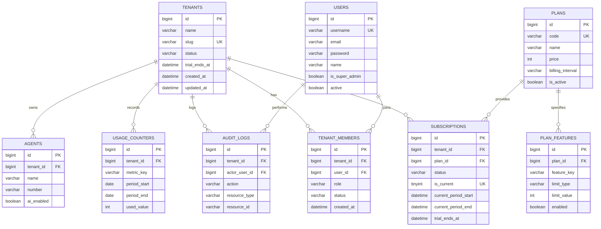

# RUANGKIRIM — CANONICAL SAAS DOMAIN MODEL SPECIFICATION
**Project:** Ruangkirim
**Repository:** `mrifatsyauqi/ruangkirim`
**Document:** Final SaaS Domain Model
**Phase:** 2B.1.1 Refinement
**Status:** APPROVED DESIGN SPECIFICATION (ZERO IMPLEMENTATION / READ-ONLY)
**Date:** September 11, 2026

---

## 1. Executive Summary

This document establishes the canonical SaaS domain model for Ruangkirim, evolving the platform from an internal single-tenant company deployment into a structured multi-tenant subscription SaaS.

The architecture is designed to fulfill strict commercial and operational requirements:
1. **Multi-Tenancy:** Workspace isolation where each customer company operates within an independent Tenant boundary.
2. **Data & Session Integrity:** Designed to preserve existing production data (Tenant 1, User 1, Agent 3, 29,941 chat history records) without intentional downtime. WhatsApp session files must not be relocated or modified (`/var/lib/ruangkirim/whatsapp/wa-session-agent-3.db`).
3. **SaaS Commercial Lifecycle:** Database-driven plans, entitlements, 30-day self-service trials, strict 1-sender trial caps, and usage tracking.
4. **Security Boundaries:** Cryptographic and database separation between platform administration (Super Admin) and tenant administration (Tenant Owner/Admin/CS).
5. **Operational Safety:** Staging-first migration, backup verification, and rollback procedures minimize operational risk.

---

## 2. Product SaaS Model

Ruangkirim is a multi-tenant WhatsApp AI Assistant and CRM platform for businesses in Indonesia.

### Commercial Tiering:
- **Free Trial:** 30-day duration, strictly limited to 1 active WhatsApp sender, core Inbox, and baseline AI capabilities.
- **Starter Plan:** Small teams requiring 1–2 WhatsApp senders, automated greetings, and basic CRM.
- **Pro Plan:** Growing e-commerce sellers requiring up to 5 WhatsApp senders, full AI auto-reply, vision checkout, and broadcasts.
- **Business / Enterprise:** Multi-agent rotation, custom AI knowledge bases, high-throughput broadcasts, and REST API access.

---

## 3. Tenant

The `Tenant` entity represents a customer workspace, business account, and commercial boundary. All operational agents, subscriptions, and customer data belong to a Tenant.

### Entity Attributes:
- `id` (bigint, unsigned, PK): Unique system identifier.
- `name` (varchar(128), NOT NULL): Business / company name.
- `slug` (varchar(64), NOT NULL, UNIQUE): URL-safe tenant identifier (e.g. `jt-batang`, `toko-berkah`).
- `status` (varchar(24), NOT NULL, DEFAULT 'active'): Workspace operational state (`trialing`, `active`, `past_due`, `suspended`, `cancelled`).
- `trial_ends_at` (datetime, NULL): Cached convenience timestamp reflecting trial expiration from the active subscription.
- `created_at` (datetime, NOT NULL)
- `updated_at` (datetime, NOT NULL)

### Tenant Operational State Machine:
```text
[ Registration ]
       │
       â–¼
   trialing ───────────► active ───────────► past_due
       │                   ▲                     │
       │ (30 days expire)  │ (Payment)           │ (Grace period ends)
       ▼                   │                     ▼
    expired ───────────────┘                 suspended
       │                                         │
       â–¼                                         â–¼
   cancelled ◄───────────────────────────────────┘
```

- `trialing`: Workspace in active 30-day trial mode. Limited to 1 sender.
- `active`: Workspace on an active paid subscription or grandfathered internal tier.
- `past_due`: Subscription renewal overdue; operating within grace period.
- `suspended`: Workspace blocked from sending outbound messages due to non-payment or administrative lock.
- `cancelled`: Workspace explicitly terminated. Data retained in read-only mode.

### Grandfathered Baseline:
Existing production Tenant (`id = 1`) is assigned `slug = 'default'`, `status = 'active'`, and `trial_ends_at = NULL`. It is not subject to trial expiration.

---

## 4. User

The `User` entity represents human authentication identity across the platform.

### Staged Email Compatibility Strategy:
To guarantee that existing production accounts continue functioning without disruption, user identity migration follows a strict three-phase plan:

1. **Phase A (Preservation & Backward Compatibility — Current Phase 2B):**
   - Preserve existing `users` table schema and authentication behavior.
   - `users.username` remains the primary unique login identifier (`username VARCHAR(64) UNIQUE NOT NULL`).
   - `users.email` remains nullable and non-unique at the database level (`email VARCHAR(255) NULL`).
   - Multi-tenant workspace association is decoupled from `users.tenant_id` and moved to `tenant_members`.
   - Existing single-tenant accounts log in with existing usernames without breakage.
2. **Phase B (Data Normalization & Audit):**
   - Background audit of all user records to ensure every active user has an authentic, verified email address.
   - Resolve any empty, duplicate, or placeholder emails before attempting schema constraints.
3. **Phase C (Constraint Enforcement — Future Release):**
   - Apply `NOT NULL` and `UNIQUE` constraints to `users.email` only after Phase B validation confirms zero data conflicts.

### Entity Attributes:
- `id` (bigint, unsigned, PK): System user ID.
- `username` (varchar(64), NOT NULL, UNIQUE): Login identifier.
- `email` (varchar(255), NULL): User email address (staged compatibility).
- `password` (varchar(255), NOT NULL): Bcrypt password hash.
- `name` (varchar(128), NOT NULL): Display name.
- `phone` (varchar(32), NULL): Contact phone number.
- `is_super_admin` (boolean, NOT NULL, DEFAULT false): Platform-level operator flag.
- `active` (boolean, NOT NULL, DEFAULT true): Account active status.
- `email_verified` (boolean, NOT NULL, DEFAULT false)
- `created_at` / `updated_at` (datetime)

---

## 5. Tenant Membership

The `TenantMember` entity links a `User` to a `Tenant`, defining the user's role and operational scope within that specific workspace.

### Entity Attributes:
- `id` (bigint, unsigned, PK)
- `tenant_id` (bigint, unsigned, NOT NULL, FK -> `tenants.id`)
- `user_id` (bigint, unsigned, NOT NULL, FK -> `users.id`)
- `role` (varchar(24), NOT NULL): Workspace role (`owner`, `admin`, `cs`).
- `status` (varchar(24), NOT NULL, DEFAULT 'active'): `active`, `invited`, `disabled`.
- `created_at` / `updated_at` (datetime)

### Uniqueness:
- `UNIQUE KEY uk_tenant_members_tenant_user (tenant_id, user_id)`: A user can belong to a given tenant at most once.

### Role Hierarchy:
1. `owner`: Full control over workspace, billing, plan changes, team management, and agent deletion. Cannot be deleted without transferring ownership.
2. `admin`: Can create/manage agents, configure knowledge base, view analytics, and manage CS users. Cannot modify billing or delete workspace.
3. `cs` (Customer Service): Operational role restricted by `CSRouteGuard`. Can only interact with conversations, contacts, and send messages on assigned agents (`user_agent_assignments`).

---

## 6. Authentication & Tenant Context

To prevent multi-tenant data leakage while supporting users who belong to multiple workspaces, the system uses a **Cryptographically Bound Active Tenant Context**.

### Authentication Flow:
1. **User Login (`POST /api/login`):** User submits credentials (`username` + `password`).
2. **Tenant Membership Discovery:** Backend queries `tenant_members` for active memberships associated with `user.ID`.
3. **Token Minting:**
   - JWT claims include:
     ```json
     {
       "user_id": 1,
       "active_tenant_id": 1,
       "role": "owner",
       "is_super_admin": false,
       "exp": 1789012345
     }
     ```
4. **Context Enforcement Middleware (`AuthMiddleware`):**
   - Parses JWT and extracts `user_id` and `active_tenant_id`.
   - Validates live DB record in `tenant_members` WHERE `user_id = ? AND tenant_id = ? AND status = 'active'`.
   - Injects into Gin context:
     - `c.Set("user_id", user.ID)`
     - `c.Set("tenant_id", active_tenant_id)`
     - `c.Set("role", membership.Role)`
     - `c.Set("is_super_admin", user.IsSuperAdmin)`
5. **Tenant Switch Endpoint (`POST /api/auth/switch-tenant`):**
   - User requests switch to `target_tenant_id`.
   - Backend verifies membership in `target_tenant_id`.
   - Issues fresh JWT minted with the new `active_tenant_id`.

**Rule:** The client cannot manipulate `tenant_id` via HTTP headers or body; it is strictly derived from the verified JWT and live database membership check.

---

## 7. Super Admin

Platform Administration is strictly separated from Tenant Administration.

### Authorization Boundary:
- `is_super_admin = true` grants access ONLY to `/api/superadmin/*` routes.
- Super Admin does **NOT** automatically have membership in customer tenants.
- Super Admin does **NOT** appear in `tenant_members`.
- Super Admin actions (tenant suspension, plan changes, manual quota overrides) are logged to `audit_logs` with `actor_user_id` and platform metadata.

---

## 8. Agent / WhatsApp Sender

The `Agent` entity represents a virtual assistant persona bound to exactly one physical WhatsApp phone number.

### Invariants:
1. **Strict Ownership:** Every Agent belongs to exactly one Tenant (`agents.tenant_id`).
2. **Global Identity:** `agents.id` remains an auto-incrementing global integer.
3. **Session File Mapping:** WhatsApp session database is deterministically named `/var/lib/ruangkirim/whatsapp/wa-session-agent-{id}.db`.
4. **Active Sender Definition:** An agent is counted as an "active sender" against plan quotas if:
   - It is not marked as soft-deleted/archived.
   - It is configured with WhatsApp connectivity (`device_j_id != ''` OR status is `connected`/`connecting`/`paired`).

---

## 9. Plans

Plans define sellable subscription tiers and commercial capabilities.

### Entity Attributes:
- `id` (bigint, unsigned, PK)
- `code` (varchar(32), NOT NULL, UNIQUE): `trial`, `starter`, `pro`, `business`.
- `name` (varchar(64), NOT NULL): e.g. "Free Trial", "Starter", "Pro", "Business".
- `description` (text)
- `price` (int, NOT NULL): Price in IDR (e.g. 0, 149000, 299000, 599000).
- `billing_interval` (varchar(16), NOT NULL): `monthly`, `yearly`.
- `is_active` (boolean, NOT NULL, DEFAULT true): Plan availability flag.
- `sort_order` (int, NOT NULL, DEFAULT 0)
- `created_at` / `updated_at` (datetime)

---

## 10. Plan Features

Defines the explicit permissions and numeric quotas granted by each plan.

### Entity Attributes:
- `id` (bigint, unsigned, PK)
- `plan_id` (bigint, unsigned, NOT NULL, FK -> `plans.id`)
- `feature_key` (varchar(64), NOT NULL): Identifier of the feature or limit.
- `limit_type` (varchar(16), NOT NULL): `boolean` or `numeric`.
- `limit_value` (int, NULL): Value for numeric limits (-1 for unlimited, NULL for boolean).
- `enabled` (boolean, NOT NULL, DEFAULT true)
- `created_at` / `updated_at` (datetime)

### Standard Feature Keys:
| Feature Key | Type | Trial | Starter | Pro | Business |
|---|---|---|---|---|---|
| `max_active_agents` | Numeric | 1 | 2 | 5 | 15 |
| `max_team_members` | Numeric | 2 | 3 | 10 | 50 |
| `monthly_messages` | Numeric | 1,000 | 5,000 | 25,000 | 100,000 |
| `monthly_ai_turns` | Numeric | 500 | 2,500 | 10,000 | 50,000 |
| `ai_autoreply` | Boolean | true | true | true | true |
| `broadcast_enabled`| Boolean | false | true | true | true |
| `api_access` | Boolean | false | false | true | true |
| `webhooks` | Boolean | false | false | true | true |
| `crm_lead_stages` | Boolean | true | true | true | true |

---

## 11. Subscription

Represents a tenant's historical and currently active commercial entitlement period.

### Source of Truth Architecture:
- **`subscriptions` = Commercial Source of Truth:** Authoritative ledger of commercial contracts, plan tiers, billing cycles, and current validity.
- **`tenants.status` = Operational Workspace State:** Operational availability flag (`active`, `suspended`, `cancelled`).
- **`tenants.trial_ends_at` = Read Cache:** Cached copy of `subscriptions.trial_ends_at` for high-speed indexing without joins.
- **Consistency Enforcement:** `SubscriptionService` is the sole service authorized to transition subscription states. Any state update synchronizes `subscriptions` and `tenants` within a single database transaction.

### Current-Record Database Enforcement (`is_current`):
To enforce that a tenant has **exactly one current subscription** at the database level:
- Column: `subscriptions.is_current TINYINT(1) NULL DEFAULT NULL`
- Constraint: `UNIQUE KEY uk_subscriptions_tenant_current (tenant_id, is_current)`
- **MySQL Invariant Mechanism:** In MySQL InnoDB, `NULL` values are treated as distinct in unique indexes. Setting `is_current = 1` for the current subscription and `is_current = NULL` for all historical/expired/cancelled subscriptions guarantees that the database engine rejects any attempt to have more than one current subscription per tenant.

### Transactional Transition Example:
```sql
START TRANSACTION;
-- Demote existing active subscription to historical
UPDATE subscriptions
SET is_current = NULL, status = 'expired', updated_at = NOW()
WHERE tenant_id = ? AND is_current = 1;

-- Insert new current subscription
INSERT INTO subscriptions (
    tenant_id, plan_id, status, is_current,
    current_period_start, current_period_end, trial_ends_at,
    created_at, updated_at
) VALUES (?, ?, 'active', 1, NOW(), NOW() + INTERVAL 30 DAY, NULL, NOW(), NOW());
COMMIT;
```

---

## 12. Trial

### Trial State Transitions:
1. **Provisioning:** On registration, Tenant is created with `status = 'trialing'`, `trial_ends_at = NOW() + 30 days`.
2. **Initial Subscription:** A subscription row is inserted with `plan_id = trial_plan_id`, `status = 'trialing'`, `is_current = 1`.
3. **Expiration Handling (Phase 2B Pragmatic Model):**
   - **Request-Time Entitlement Evaluation:** When an authenticated request arrives, `EntitlementService` checks if `status == 'trialing' AND NOW() > trial_ends_at`. If expired, it triggers an in-transaction status update to `expired`.
   - **Scheduled Reconciliation Sweeper:** A periodic background job (`ReconcileSubscriptions`) checks for expired trials daily and flags them without waiting for user traffic.
   - **Behavior on Expiration:**
     - Dashboard remains accessible in read-only mode.
     - Customer data, chat histories, and knowledge items are preserved.
     - Outbound message sending and AI replies are paused.
     - Creation of new agents is blocked.

---

## 13. Sender Limits

### Trial Cap:
- During trial, a tenant is allowed **maximum 1 active WhatsApp sender**.

### Enforcement Entry Points (Centralized):
1. `POST /api/agents` (Create Agent)
2. `POST /api/agents/:id/wa/connect` (Connect WhatsApp)
3. `POST /api/agents/:id/wa/connect-pairing` (Pairing Code Connect)
4. Public API `/v1/*` Agent provisioning

If an agent creation or connection attempt exceeds the plan's `max_active_agents`, the request is rejected with HTTP 403:
`{"error": "Batas kuota nomor WhatsApp tercapai. Silakan upgrade paket Anda."}`

---

## 14. Usage

Lightweight, predictable quota tracking per billing period without heavyweight event streaming.

### Entity Attributes (`usage_counters`):
- `id` (bigint, unsigned, PK)
- `tenant_id` (bigint, unsigned, NOT NULL, FK -> `tenants.id`)
- `metric_key` (varchar(64), NOT NULL): e.g. `monthly_messages`, `monthly_ai_turns`.
- `period_start` (date, NOT NULL): Start date of billing cycle (e.g. `2026-09-01`).
- `period_end` (date, NOT NULL): End date of billing cycle (e.g. `2026-09-30`).
- `used_value` (int unsigned, NOT NULL, DEFAULT 0): Accumulated count.
- `updated_at` (datetime, NOT NULL)

### Uniqueness:
- `UNIQUE KEY uk_usage_counters_tenant_metric_period (tenant_id, metric_key, period_start, period_end)`

---

## 15. Entitlement Service

The central backend authority replacing hardcoded `tenantPlanAllows()` stubs.

### Core Interface:
```go
type EntitlementService interface {
    // Check if a boolean feature is enabled for tenant
    CanUseFeature(tenantID uint, featureKey string) (bool, error)

    // Check if tenant has remaining quota for a numeric metric
    CanConsumeQuota(tenantID uint, metricKey string, amount int) (bool, error)

    // Increment quota usage atomically
    ConsumeQuota(tenantID uint, metricKey string, amount int) error

    // Return max active sender limit for tenant
    GetActiveSenderLimit(tenantID uint) (int, error)

    // Get full subscription & entitlement summary
    GetTenantSubscriptionState(tenantID uint) (*SubscriptionState, error)
}
```

---

## 16. Knowledge Ownership

### Architecture Decision:
- **Decision:** Dual-Scope Knowledge Base (`Tenant` primary scope, optional `Agent` override).
- **Rationale:** Businesses typically share a central product catalog and FAQ across all customer service lines, with optional per-agent customizations.
- **Model:** Table `knowledges` receives `tenant_id` (NOT NULL). `agent_id` becomes optional (`NULL` for tenant-wide shared knowledge).

---

## 17. Contact Ownership

### Architecture Decision:
- **Decision:** Retain Agent-Scoped Contacts for Phase 2B, with additive `tenant_id` indexing.
- **Rationale:** Retaining agent scoping avoids complex multi-agent contact merging and thread deduplication in Phase 2B, while `tenant_id` enables tenant-level contact volume checks.

---

## 18. Broadcast / Follow-up / Flow Ownership

- `broadcasts`: Direct `tenant_id` owned. Multi-agent rotation validates that every agent in `agent_ids` belongs to the same `tenant_id`.
- `broadcast_recipients`: Scoped via `broadcast_id -> broadcasts.tenant_id`.
- `follow_ups`: Direct `tenant_id` owned.
- `flows`: Scoped via `agent_id -> agents.tenant_id`.

---

## 19. API Keys / Webhooks

- API keys and Webhook configs remain bound to `models.Agent`.
- Public REST API `/api/v1/*` resolves `agent` via `api_key`.
- `APIKeyMiddleware` verifies:
  1. `agent.APIKey` matches.
  2. Agent's owning tenant has an active subscription allowing `api_access`.
  3. Sets `tenant_id` in context to ensure downstream operations respect tenant boundaries.

---

## 20. Settings

- **Platform Settings (`app_settings`):** Global AI provider keys (OpenRouter, Gemini) and system presets managed exclusively by Super Admin.
- **Tenant Settings:** Reserved for business profile, branding, and notification configurations.
- **Agent Settings (`agents`):** Persona, tone, greeting message, and business hours remain on `Agent`.
- **Legacy `settings` table:** Obsolete; marked for formal deprecation.

---

## 21. Audit Logs

Audit trail for administrative, security, and subscription events.

### Entity Attributes (`audit_logs`):
- `id` (bigint, unsigned, PK)
- `tenant_id` (bigint, unsigned, NULL): Tenant context (NULL for system/platform actions).
- `actor_user_id` (bigint, unsigned, NULL): User performing the action.
- `action` (varchar(64), NOT NULL): e.g. `tenant.created`, `plan.changed`, `agent.deleted`.
- `resource_type` (varchar(64), NOT NULL): `tenant`, `subscription`, `agent`, `user`.
- `resource_id` (varchar(64), NOT NULL)
- `metadata_json` (text, NULL)
- `ip_address` (varchar(45), NULL)
- `created_at` (datetime, NOT NULL)

---

## 22. Billing Readiness

Phase 2B focuses strictly on the internal subscription and entitlement state machine. Payment gateway integrations (Tripay, Midtrans, Stripe) are decoupled and deferred to future billing phases.

---

## 23. Security Invariants

1. **Isolation Invariant:** A request authenticated under `tenant_id = X` shall never observe, mutate, or delete records belonging to `tenant_id = Y`.
2. **Path Traversal Invariant:** When accessing a sub-resource via `/agents/:id/resource/:rid`, the backend must assert:
   `agent.tenant_id == ctx.tenant_id AND resource.agent_id == agent.id`.
3. **Session Invariant:** WhatsApp engine instances `services.WA(agentID)` are partitioned by global `agentID`. No cross-tenant session lookup is possible.
4. **Super Admin Invariant:** Platform administrators cannot modify tenant business data without explicit audit logging.

---

## 24. Canonical ER Diagram



---

## 25. Resource Ownership Diagram

```text
=============================================================================
                           RESOURCE OWNERSHIP MODEL
=============================================================================

[ PLATFORM LAYER ]
   ├── app_settings (Global AI config & API keys)
   ├── shipping_cities (RajaOngkir global cache)
   ├── login_throttles (IP/user login rate limits)
   └── plans & plan_features (Commercial package definitions)

[ TENANT LAYER ] (Directly owned by Tenant ID)
   ├── tenants (Workspace record)
   ├── tenant_members (User-Tenant relationship)
   ├── subscriptions & usage_counters (Billing & quotas)
   ├── audit_logs (Workspace audit history)
   ├── products, product_orders, product_checkout_sessions
   ├── broadcasts & follow_ups
   ├── ai_forms, ai_form_sessions, ai_form_submissions
   ├── scheduled_messages & scheduled_statuses
   └── cs_activity_logs & user_agent_assignments

[ AGENT LAYER ] (Owned by Agent ID -> Agent owned by Tenant ID)
   ├── agents (WhatsApp virtual assistant profile)
   ├── WhatsApp SQLite Session (/var/lib/ruangkirim/whatsapp/wa-session-agent-{id}.db)
   ├── chat_histories (29,941 rows - High performance isolation)
   ├── inbox_read_states (5,163 conversation cursor states)
   ├── contacts (532 customer phone records)
   ├── conversation_memories, ai_turns, handoffs
   ├── auto_replies, flows, flow_sessions
   ├── templates, labels, chat_labels
   └── crawl_jobs, crawl_pages
=============================================================================
```

---

## 26. Architecture Decision Records (ADRs)

### ADR-01: Tenant Membership Model
- **Decision:** Introduce `tenant_members` join table representing many-to-many relationship between Users and Tenants.
- **Reason:** Real-world businesses require multi-user teams (Owner, Admin, CS) and users who may consult for or own multiple businesses.
- **Alternatives Considered:** Keeping single scalar `users.tenant_id`. Rejected because it permanently blocks multi-workspace collaboration.
- **Trade-offs:** Requires token refresh/switch endpoint when changing workspaces.
- **Impact:** Clean authorization foundation for team expansion.

### ADR-02: Tenant Context Resolution
- **Decision:** Derive active `tenant_id` strictly from JWT claims verified against live database membership; do not trust client query parameters or request body for tenant identification.
- **Reason:** Guarantees zero cross-tenant spoofing.
- **Alternatives Considered:** Passing `X-Tenant-ID` header. Rejected as unsafe without per-request DB validation.
- **Impact:** Eliminates authorization bypass vulnerabilities.

### ADR-03: Plan & Subscription Ownership
- **Decision:** Subscriptions are owned by Tenants, not individual Users.
- **Reason:** A commercial subscription pays for the business workspace and its senders, regardless of which team member manages it.
- **Impact:** If the owner leaves or changes, the workspace and senders remain uninterrupted.

### ADR-04: Trial Model Architecture
- **Decision:** 30-day trial recorded in `subscriptions.trial_ends_at` with `is_current = 1`, and cached on `tenants.trial_ends_at`.
- **Reason:** Dual-recording allows fast workspace status checks on `tenants` while maintaining strict subscription audit trails.
- **Impact:** Clean trial enforcement and straightforward upgrade path.

### ADR-05: Sender Limit Enforcement
- **Decision:** Enforce sender limits centrally in Go service layer at agent creation and WhatsApp connection.
- **Reason:** Prevents bypassing limits via direct API calls or script automation.
- **Impact:** Trial accounts strictly limited to 1 active WhatsApp sender.

### ADR-06: Usage Model
- **Decision:** Synchronous periodic counter table (`usage_counters`) using `(tenant_id, metric_key, period_start, period_end)`.
- **Reason:** Simplest, most reliable implementation without requiring external Redis or Kafka streaming infrastructure.
- **Impact:** Zero additional operational dependencies for VPS hosting.

### ADR-07: Indirect Agent Ownership for Large Tables
- **Decision:** Retain indirect tenant scoping for `chat_histories` (29,941 rows) and `inbox_read_states` (5,163 rows) via `agent_id -> agents.tenant_id`.
- **Reason:** Modifying 30,000+ rows during startup or synchronous migration risks severe table locks, timeouts, and production downtime. Handlers already enforce `resolveAgent()`.
- **Impact:** High operational safety and avoidance of intentional downtime.

### ADR-08: Knowledge Base Scope
- **Decision:** Transition `knowledges` to direct Tenant ownership with an optional `agent_id` override.
- **Reason:** Allows multiple WhatsApp agents in the same tenant to share common business knowledge.
- **Impact:** Eliminates duplicate knowledge entry for multi-agent setups.

### ADR-09: Contact Ownership
- **Decision:** Retain agent-scoped contacts for Phase 2B; defer unified contact deduplication to future CRM phase.
- **Reason:** Minimizes Phase 2B scope and eliminates risk to active customer interactions.
- **Impact:** Safe, incremental rollout.

### ADR-10: AutoMigrate Governance
- **Decision:** Govern GORM `AutoMigrate` so production schema changes are strictly controlled, additive, and executed only through pre-tested scripts.
- **Reason:** Uncontrolled AutoMigrate on startup is a crash hazard for production.
- **Impact:** Predictable, reversible deployments.

### ADR-11: Existing Tenant 1 Migration
- **Decision:** Grandfather Tenant 1 as active internal company tenant (`slug = 'default'`, `status = 'active'`).
- **Reason:** Preserves existing live business operations without forcing artificial trial or payment states.
- **Impact:** Continuity for live Agent 3 WhatsApp operations.

### ADR-12: WhatsApp Session Preservation
- **Decision:** WhatsApp session files must not be relocated or modified on disk (`wa-session-agent-{id}.db`).
- **Reason:** Preserves active WhatsApp authentication keys and prevents user re-login/QR requirements.
- **Impact:** Session persistence across the migration.

---

## 27. Phase 2B Scope (Must Have)
- Finalize domain model and database specification.
- Govern AutoMigrate and establish controlled migration ordering.
- Add `slug`, `status`, and `trial_ends_at` to `tenants`.
- Create `tenant_members`, `plans`, `plan_features`, `subscriptions`, and `usage_counters`.
- Seed standard plans (`trial`, `starter`, `pro`, `business`) and Tenant 1 grandfathered subscription.
- Replace `tenantPlanAllows()` stubs with centralized `EntitlementService`.
- Enforce maximum 1 sender limit on trial tenants.
- Protect all routes with verified multi-tenant context.

---

## 28. Future Scope (Out of Scope for Phase 2B)
- Automated payment gateway integration (Tripay / Midtrans).
- Invoice generation and automated tax calculation.
- Coupon, affiliate, and discount code engine.
- Shared multi-agent CRM contact deduplication.
- Super Admin tenant impersonation ("login as tenant").
- Single Sign-On (Google / SAML OAuth).

---

## 29. Final Domain Model Verdict

**CANONICAL DOMAIN MODEL: APPROVED FOR SPECIFICATION**
The refined architecture satisfies all multi-tenant SaaS requirements, guarantees backward compatibility for existing user logins, establishes strong database-level subscription constraints, and provides a safe path for Phase 2B database migration.
